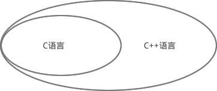
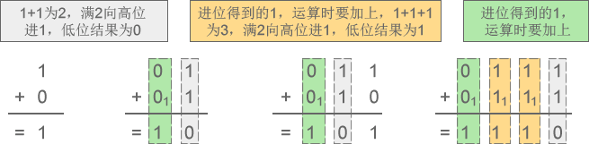

#编程基础

## 1.1 通俗地理解什么是编程语言

学习编程语言之前，首先要搞清楚“编程语言”这个概念。

很小的时候，父母就教我们开口说话，也教我们如何理解别人讲话的意思。经过长时间的熏陶和自我学习，我们竟然在不知不觉中学会了说话，同时也能听懂其他小朋友说话的意思了，我们开始向父母要零花钱买零食和玩具、被欺负了向父母倾诉……

我们说的是汉语，是“中国语言”，只要把我们的需求告诉父母，父母就会满足，我们用“中国语言”来控制父母，让父母做我们喜欢的事情。

“中国语言”有固定的格式，每个汉字代表的意思不同，我们必须正确的表达，父母才能理解我们的意思。例如让父母给我们10元零花钱，我们会说“妈妈给我10块钱吧，我要买小汽车”。如果我们说“10元给我汽车小零花钱妈妈”，或者“妈妈给我10亿人民币，我要买F-22”，妈妈就会觉得奇怪，听不懂我们的意思，或者理解错误，责备我们。

我们通过有固定格式和固定词汇的“语言”来控制他人，让他人为我们做事情。语言有很多种，包括汉语、英语、法语、韩语等，虽然他们的词汇和格式都不一样，但是可以达到同样的目的，我们可以选择任意一种语言去控制他人。

**同样，我们也可以通过”语言“来控制计算机，让计算机为我们做事情，这样的语言就叫做编程语言（Programming Language）。**

编程语言也有固定的格式和词汇，我们必须经过学习才会使用，才能控制计算机。

编程语言有很多种，常用的有C语言、C++、Java、C#、Python、PHP、JavaScript、Go语言、Objective-C、Swift、汇编语言等，每种语言都有自己擅长的方面，例如：

|编程语言| 主要用途 |
|----| ---- |
|C/C++|C++ 是在C语言的基础上发展起来的，C++ 包含了C语言的所有内容，C语言是C++的一个部分，它们往往混合在一起使用，所以统称为 C/C++。C/C++主要用于PC软件开发、Linux开发、游戏开发、单片机和嵌入式系统。|
|Java|Java 是一门通用型的语言，可以用于网站后台开发、Android 开发、PC软件开发，近年来又涉足了大数据领域（归功于 Hadoop 框架的流行）。|
|C#|C# 是微软开发的用来对抗 Java 的一门语言，实现机制和 Java 类似，不过 C# 显然失败了，目前主要用于 Windows 平台的软件开发，以及少量的网站后台开发。|
|Python|Python 也是一门通用型的语言，主要用于系统运维、网站后台开发、数据分析、人工智能、云计算等领域，近年来势头强劲，增长非常快。|
|PHP|PHP 是一门专用型的语言，主要用来开发网站后台程序。|
|JavaScript|JavaScript 最初只能用于网站前端开发，而且是前端开发的唯一语言，没有可替代性。近年来由于 Node.js 的流行，JavaScript 在网站后台开发中也占有了一席之地，并且在迅速增长。|
|Go语言|Go语言是 2009 年由 Google 发布的一款编程语言，成长非常迅速，在国内外已经有大量的应用。Go 语言主要用于服务器端的编程，对 C/C++、Java 都形成了不小的挑战。|
|Objective-C Swift|Objective-C 和 Swift 都只能用于苹果产品的开发，包括 Mac、MacBook、iPhone、iPad、iWatch 等。|
|汇编语言|汇编语言是计算机发展初期的一门语言，它的执行效率非常高，但是开发效率非常低，所以在常见的应用程序开发中不会使用汇编语言，只有在对效率和实时性要求极高的关键模块才会考虑汇编语言，例如操作系统内核、驱动、仪器仪表、工业控制等。|

可以将不同的编程语言比喻成各国语言，为了表达同一个意思，可能使用不同的语句。例如，表达“世界你好”的意思：

- 汉语：世界你好；
- 英语：Hello World
- 法语：Bonjour tout le monde

在编程语言中，同样的操作也可能使用不同的语句。例如，在屏幕上显示“HelloWorld”：

- C语言：`puts("HelloWorld");`
- PHP：`echo "HelloWorld";`
- Java：`System.out.println("HelloWorld");`

编程语言类似于人类语言，由直观的词汇组成，我们很容易就能理解它的意思，例如在C语言中，我们使用 `puts` 这个词让计算机在屏幕上显示出文字；`puts` 是 `output string`（输出字符串）的缩写。

使用 `puts` 在屏幕上显示“C语言中文网”：
`puts("HelloWorld");`
我们把要显示的内容放在`(`和`)`之间，并且在最后要有;。你必须要这样写，这是固定的格式。

**总结：编程语言是用来控制计算机的一系列指令（Instruction），它有固定的格式和词汇（不同编程语言的格式和词汇不一样），必须遵守，否则就会出错，达不到我们的目的。**

C语言（C Language）是编程语言的一种，学习C语言，主要是学习它的格式和词汇。下面是一个C语言的完整例子，它会让计算机在屏幕上显示”C语言中文网“。

> 这个例子主要演示C语言的一些固有格式和词汇，看不懂的读者不必深究，也不必问为什么是这样，后续我们会逐步给大家讲解。

```
#include <stdio.h>
int main(){
    puts("Hello world");
    return 0;
}
```

这些具有特定含义的词汇、语句，按照特定的格式组织在一起，就构成了源代码（Source Code），也称源码或代码（Code）。

那么，C语言肯定规定了源代码中每个词汇、语句的含义，也规定了它们该如何组织在一起，这就是语法（Syntax）。它与我们学习英语时所说的“语法”类似，都规定了如何将特定的词汇和句子组织成能听懂的语言。

编写源代码的过程就叫做编程（Program）。从事编程工作的人叫程序员（Programmer）。程序员也很幽默，喜欢自嘲，经常说自己的工作辛苦，地位低，像农民一样，所以称自己是”码农“，就是写代码的农民。也有人自嘲称是”程序猿“。

## 1.2 C语言究竟是一门怎样的语言

对于大部分程序员，C语言是学习编程的第一门语言，很少有不了解C的程序员。

C语言除了能让你了解编程的相关概念，带你走进编程的大门，还能让你明白程序的运行原理，比如，计算机的各个部件是如何交互的，程序在内存中是一种怎样的状态，操作系统和用户程序之间有着怎样的“爱恨情仇”，这些底层知识决定了你的发展高度，也决定了你的职业生涯。

如果你希望成为出类拔萃的人才，而不仅仅是码农，这么这些知识就是不可逾越的。也只有学习C语言，才能更好地了解它们。有了足够的基础，以后学习其他语言，会触类旁通，很快上手，7 天了解一门新语言不是神话。

**C语言概念少，词汇少，包含了基本的编程元素，后来的很多语言（C++、Java等）都参考了C语言，说C语言是现代编程语言的开山鼻祖毫不夸张，它改变了编程世界。**

正是由于C语言的简单，对初学者来说，学习成本小，时间短，结合本教程，能够快速掌握编程技术。

### C语言难吗？

和 Java、C++、Python、C#、JavaScript 等高级编程语言相比，C语言涉及到的编程概念少，附带的标准库小，所以整体比较简洁，容易学习，非常适合初学者入门。

编程语言的发展大概经历了以下几个阶段：
```
汇编语言 --> 面向过程编程 --> 面向对象编程
```

- 汇编语言是编程语言的拓荒年代，它非常底层，直接和计算机硬件打交道，开发效率低，学习成本高；
- C语言是面向过程的编程语言，已经脱离了计算机硬件，可以设计中等规模的程序了；
- Java、C++、Python、C#、PHP 等是面向对象的编程语言，它们在面向过程的基础上又增加了很多概念。

C语言出现的时候，已经度过了编程语言的拓荒年代，具备了现代编程语言的特性，但是这个时候还没有出现“软件危机”，人们没有动力去开发更加高级的语言，所以也没有太复杂的编程思想。

**也就是说，C语言虽然是现代编程语言，但是它涉及到的概念少，词汇少，思想也简单。C语言学习成本小，初学者能够在短时间内掌握编程技能，非常适合入门。**

### C语言是计算机产业的核心语言

也许是机缘巧合，C语言出现后不久，计算机产业开始爆发，计算机硬件越来越小型化，越来越便宜，逐渐进入政府机构，进入普通家庭，C语言成了编程的主力军，获得了前所未有的成功，操作系统、常用软件、硬件驱动、底层组件、核心算法、数据库、小游戏等都使用C语言开发。

雷军说过，站在风口上，猪都能飞起来；C语言就是那头猪，不管它好不好，反正它飞起来了。

**C语言在计算机产业大爆发阶段被万人膜拜，无疑会成为整个软件产业的基础，拥有核心地位。**

软件行业的很多细分学科都是都是基于C语言的，学习数据结构、算法、操作系统、编译原理等都离不开C语言，所以大学将C语言作为一门公共课程，计算机相关专业的同学都要学习。

C语言被誉为“上帝语言”，它不但奠定了软件产业的基础，还创造了很多其它语言，例如：

- PHP、Python 等都是用C语言开发出来的，虽然平时做项目的时候看不到C语言的影子，但是如果想深入学习 PHP 和 Python，那就要有C语言基础了。
- C++ 和 Objective-C 干脆在C语言的基础上直接进行扩展，增加一些新功能后变成了新的语言，所以学习 C++ 和 Objective-C 之前也要先学习C语言。

C语言是有史以来最为重要的编程语言：要进入编程行业高手级别必学C语言，要挣大钱必学C语言，要做黑客、红客必学C语言，要面试名企、外企、高薪职位必学C语言。

## C语言是菜鸟和大神的分水岭

作为一门古老的编程语言，C语言已经坚挺了好几十年了，初学者从C语言入门，大学将C语言视为基础课程。不管别人如何抨击，如何唱衰，C语言就是屹立不倒；Java、C#、Python、PHP、Perl 等都有替代方案，它们都可以倒下，唯独C语言不行。

程序是在内存中运行的（我们将在《载入内存，让程序运行起来》一节中详细说明），一名合格的程序员必须了解内存，学习C语言是了解内存布局的最简单、最直接、最有效的途径，C语言简直是为内存而生的，它比任何一门编程语言都贴近内存。

所有的程序都在拼尽全力节省内存，都在不遗余力提高内存使用效率，计算机的整个发展过程都在围绕内存打转，不断地优化内存布局，以保证可以同时运行多个程序。

不了解内存，就学不会进程和线程，就没有资格玩中大型项目，没有资格开发底层组件，没有资格架构一个系统，命中注定你就是一个菜鸟，成不了什么气候。

以上这点我有深刻的体会！工作期间我曾专注于网站开发，虽然能够设计出界面漂亮、体验良好的网页，但是对内存泄漏、多线程、共享内存等底层概念一窍不通，感觉和周围同事的差距很大，这让我非常郁闷，不知道如何突破。我曾多次尝试学习内存和线程，也找了很多资料，但是无论如何都啃不懂，到头来还是一头雾水。

于是决定再次系统、深入、全面地学习C语言，并结合C语言去了解一些内存知识，这个时候我才发现，原来C语言就是为内存而生的，C语言的设计和内存的布局是严密贴合的，我因为学习C语言而吃透了内存，了解了计算机内存是如何分布和组织的。

> C语言无时无刻不在谈内存，内存简直就是如影随形，你不得不去研究它。

至关重要的一点是，我能够把内存和具体的编程知识以及程序的运行过程结合起来，真正做到了学以致用，让概念落地，而不是空谈，这才是最难得的。

另外一个惊喜是，攻克内存后我竟然也能够理解进程和线程了，原来进程和线程也是围绕内存打转的，从一定程度上讲，它们的存在也是为了更加高效地利用内存。

**从C语言到内存，从内存到进程和线程，环环相扣：不学C语言就吃不透内存，不学内存就吃不透进程和线程。**

我感觉自己瞬间升华了，达到了一个新的高度，之前的很多谜团都解开了，和大神交流也没有障碍了。

「内存 + 进程 + 线程」这几个最基本的计算机概念是菜鸟和大神的分水岭，也只有学习C语言才能透彻地理解它们。Java、C#、PHP、Python、JavaScript 程序员工作几年后会遇到瓶颈，有很多人会回来学习C语言，重拾底层概念，让自己再次突破。

## 初学者最常问的几个问题
隔行如隔山，初学编程往往不知道从何入手，非常迷茫，以下几个问题是我经常被问到的，总结出来分享给读者。
### 1) 多久能学会编程？
这是一个没有答案的问题。每个人投入的时间、学习效率和基础都不一样。**如果你每天都拿出大把的时间来学习，那么两三个月就可以学会C/C++，不到半年时间就可以编写出一些软件。**

**但是有一点可以肯定，几个月从小白成长为大神是绝对不可能的。**要想出类拔萃，没有几年功夫是不行的。学习编程不是看几本书就能搞定的，需要你不断的练习，编写代码，积累零散的知识点，代码量跟你的编程水平直接相关，没有几万行代码，没有拿得出手的作品，怎能称得上“大神”。

每个人程序员都是这样过来的，开始都是一头雾水，连输出九九乘法表都很吃力，只有通过不断练习才能熟悉，这是一个强化思维方式的过程。

知识点可以在短时间内了解，但是思维方式和编程经验需要不断实践才能强化，这就是为什么很多初学者已经了解了C语言的基本概念，但是仍然不会编写代码的原因。

程序员被戏称为”码农“，意思是写代码的农民，要想成为一个合格的农民，必须要脚踏实地辛苦耕耘。

也不要压力太大，一切编程语言都是纸老虎，一层窗户纸，只要开窍了，就容易了。

### 2) 学编程难吗？
编程是一门技术，我也不知道它难不难，我只知道，只要你想学，肯定能学会。技术就是一层窗户纸，是有道理可以遵循的，在我看来，比搞抽象的艺术要容易。

**在技术领域，编程的入门门槛很低，互联网的资料很多，只要你有一台计算机，一根网线，具备初中学历，就可以学习，投资在5K左右。**

不管是技术还是非技术，要想有所造诣，都必须潜心钻研，没有几年功夫不会鹤立鸡群。所以请先问问你自己，你想学编程吗，你喜欢吗，如果你觉得自己对编程很感兴趣，想了解软件或网站是怎么做的，那么就不要再问这个问题了，尽管去学就好了。

### 3) 英语和数学基础不行，可以学会吗？初中毕业可以学会吗？

首先说英语。编程需要你有英语基础，初中水平完全可以胜任。编程起源于美国，代码中会出现很多单词，有英语基础记忆起来会非常容易，如果你不认识也没关系，我推荐你安装有道词典，它的划词功能非常棒，选中什么就及时翻译什么，不管是句子还是单词。这样，相信你开发出常用的软件不成问题。

当然，如果你希望达到很高的造诣，希望被人称为大神，那么肯定要阅读英文的技术资料（不是所有资料都被翻译成了中文），初中水平就有点吃力了。不过，长期阅读英文会提高你的英文水平，只要你坚持一段时间，即使只有初中水平，我相信借助有道词典也会提高很快。

如果你没有学过英语，不知道 am、is、are，那我该怎么说呢，有志者事竟成，只要你想学，相信英语的障碍你也能克服。

至于数学，只要你不打算搞算法、机器学习/人工智能、大数据/数据分析，会加减乘除法，知道次方、开方、科学计数法等最基本的概念，就不要把数学当做学习的障碍了。

### 4) 需要什么配置的电脑

如果你囊中羞涩，3K以上的台式机，4K以上的笔记本也可以胜任，当然有时候会卡顿。

经济条件允许的话，最好5K以上的台式机，6K以上的笔记本。

如果想从事编程行业，你早晚要有一台高配的机器。它不但会让你工作更加流畅有效率，还会让你觉得工作是一种享受，所以很多程序员配备了MacBook。

### 5) 学习编程要用Linux吗

很多大神都轻视地说，我不用Windows，一直在用Linux，只有Linux才能让你看到C的本质，C就是为Linux而生的。

话虽没错，但是你想想当初你学习Windows花了多长时间，是不是一开始连切换输入法也不会，编辑Word文档也不会；如果你切换到Linux，你也会遇到同样的问题，你需要一段时间来熟悉Linux，加大了你的学习成本，会慢慢消磨掉你对编程的兴趣。

所以我建议，你可以在Windows下学习C语言，完全没问题，如果有一天Windows不能满足你的学习需求了，那你再切换到Linux，这个时候你对编程C和C++到底有什么关系
已经很了解了，切换的成本也低了。

## C和C++到底有什么关系
C++ 读作”C加加“，是”C Plus Plus“的简称。顾名思义，C++是在C的基础上增加新特性，玩出了新花样，所以叫”C Plus Plus“，就像 iPhone 6S 和 iPhone 6、Win10 和 Win7 的关系。

C语言是1972年由美国贝尔实验室研制成功的，在当时算是高级语言，它的很多新特性都让汇编程序员羡慕不已，就像今天的Go语言，刚出生就受到追捧。C语言也是”时髦“的语言，后来的很多软件都用C语言开发，包括 Windows、Linux 等。

但是随着计算机性能的飞速提高，硬件配置与几十年前已有天壤之别，软件规模也不断增大，很多软件的体积都超过 1G，例如 PhotoShop、Visual Studio 等，用C语言开发这些软件就显得非常吃力了，这时候C++就应运而生了。

C++ 主要在C语言的基础上增加了面向对象和泛型的机制，提高了开发效率，以适用于大中型软件的编写。

### C++和C的血缘关系

早期并没有”C++“这个名字，而是叫做”带类的C“。”带类的C“是作为C语言的一个扩展和补充出现的，目的是提高开发效率，如果你有Java Web开发经验，那么你可以将它们的关系与 Java 和 JSP 的关系类比。

这个时期的C++非常粗糙，仅支持简单的面向对象编程，也没有自己的编译器，而是通过一个预处理程序（名字叫 cfront），先将C++代码”翻译“为C语言代码，再通过C语言编译器合成最终的程序。

随着C++的流行，它的语法也越来越强大，已经能够很完善的支持面向对象编程和泛型编程。但是一直也没有诞生出新的C++编译器，而是对原来C编译器不断扩展，让它支持C++的新特性，所以我们通常称为C/C++编译器，因为它同时支持C和C++，例如 Windows 下的微软编译器(cl.exe)，Linux 下的 GCC 编译器。

**也就是说，你写的C、C++代码都会通过一个编译器来编译，很难说C++是一门独立的语言，还是对C的扩展。**

 

### 关于C++的学习

**从“学院派”的角度来说，C++支持面向过程编程、面向对象编程和泛型编程，而C语言仅支持面向过程编程。就面向过程编程而言，C++和C几乎是一样的，所以学习了C语言，也就学习了C++的一半，不需要从头再来。**

## 学了C语言到底能做什么，能从事什么工作

在计算机高速发展的最近几十年中，出现了上百种编程语言，有的编程语言是针对某个领域专门设计的，例如：

- PHP 专门用来开发网站后台；
- JavaScript 最初只能用于网站前端开发，实现一些网页特效，后来有“好事的”程序员将它移植到服务器上，才赋予 JavaScript 网站后台开发的能力；
- Objective-C 和 Swift 只能用于苹果产品的开发，包括 iPhone、iPad、Mac、MacBook 等；
- Visual Basic（VB）专门用来在 Windows 平台下进行软件开发。

而大部分的编程语言不是针对某个特定领域设计的，它们能做很多事情，比较通用化。但是在长期的实践过程中，这些编程语言也找到了适合自己的位置，例如：

- Java 可以用于网站后台开发、Android 开发、PC软件开发，在大数据领域也分得一杯羹；
- Python 主要用于系统运维、网站后台开发、数据分析、人工智能、云计算等领域；
- Go语言除了用于服务器、通讯等较底层的开发，还能用于网站后台开发。

C语言也是一门通用性的语言，并没有针对某个领域进行优化，就目前而言，C语言主要用于较底层的开发，例如：

- Windows、Linux、Unix 等操作系统的内核90%以上都使用C语言开发；
- 开发硬件驱动，让硬件和操作系统连接起来，这样用户才能使用硬件、程序员才能控制硬件；
- 单片机和嵌入式属于软硬件的结合，有很多使用C语言的地方；
- 开发系统组件或服务，用于支撑上层应用；
- 编写PHP扩展，增强PHP的功能；
- 如果对软件某个模块（例如算法和搜索部分）的效率要求较高，也可以使用C语言来开发。

当然，C语言也能用于PC软件开发，做出类似 QQ、迅雷、Chrome 等带界面的程序，但是由于C语言开发效率低，第三方库较少，实际项目中已经没有程序员这么做了，大家已经转向了 C++。

### 初学者的疑问

既然C语言能做这么多事情，为什么很多初学者学完C语言以后仍然非常迷茫，只能编写没有界面的控制台程序呢？

这是因为，C语言仅仅是一个工具，它的标准库也很简单，只提供了最基本的功能，如果希望开发出实用的程序，往往还需要学习其他方面的知识。例如：

- 开发硬件驱动要学习数字电路，了解 Windows 或 Linux 内核，阅读硬件厂商的接口说明书；
- 从事嵌入式开发要学习数字电路、模拟电路、ARM、Linux、Qt等；
- 开发PC软件要学习Windows编程，了解 GTK。

**可以这么说，如果只会C语言，基本上是找不到工作的，读者要选定一个方向，继续学习其他知识。后面你会发现，C语言不过是冰山一角，是一项基本技能而已，程序员要学习的东西还很多。**

《C和C++到底有什么关系》一节中讲到，C++是C语言的拓展和升级，极大提高了程序员的开发效率。和C语言类似，C++也是一门通用性的语言，主要用于PC软件开发、服务器底层开发、游戏开发等。

C++和C语言之间有着非常模糊的界限，很少有只会C语言的程序员，往往还需要掌握C++，以提高开发效率。

另外，学习C语言并不一定要从事与C语言有关的开发工作。C语言是一门简单、底层、较早的编程语言，后来的很多语言在语法上都和C语言类似，称为“类C语言”，例如 Java、C++、C#、PHP、JavaScript 等，学完C语言再学这些语言都很容易上手。

并且，C语言能够让你更加深刻的认识内存和编译原理，了解程序的每一个细节，夯实基本功，站得“低”才能望的远，所以优秀的程序员都会学习C语言。

## 二进制、八进制和十六进制

我们平时使用的数字都是由 0~9 共十个数字组成的，例如 1、9、10、297、952 等，一个数字最多能表示九，如果要表示十、十一、二十九、一百等，就需要多个数字组合起来。

例如表示 5+8 的结果，一个数字不够，只能”进位“，用 13 来表示；这时”进一位“相当于十，”进两位“相当于二十。

因为逢十进一（满十进一），也因为只有 0~9 共十个数字，所以叫做十进制（Decimalism）。十进制是在人类社会发展过程中自然形成的，它符合人们的思维习惯，例如人类有十根手指，也有十根脚趾。

进制也就是进位制。进行加法运算时逢X进一（满X进一），进行减法运算时借一当X，这就是X进制，这种进制也就包含X个数字，基数为X。十进制有 0~9 共10个数字，基数为10，在加减法运算中，逢十进一，借一当十。

### 二进制

我们不妨将思维拓展一下，既然可以用 0~9 共十个数字来表示数值，那么也可以用0、1两个数字来表示数值，这就是二进制（Binary）。例如，数字 0、1、10、111、100、1000001 都是有效的二进制。

在计算机内部，数据都是以二进制的形式存储的，二进制是学习编程必须掌握的基础。本节我们先讲解二进制的概念，下节讲解数据在内存中的存储，让大家学以致用。

二进制加减法和十进制加减法的思想是类似的：

 - 对于十进制，进行加法运算时逢十进一，进行减法运算时借一当十；
- 对于二进制，进行加法运算时逢二进一，进行减法运算时借一当二。

下面两张示意图详细演示了二进制加减法的运算过程。

1) 二进制加法：1+0=1、1+1=10、11+10=101、111+111=1110

 

图1：二进制加法示意图

2) 二进制减法：1-0=1、10-1=1、101-11=10、1100-111=101

 

图2：二进制减法示意图

### 八进制

除了二进制，C语言还会使用到八进制。

八进制有 0~7 共8个数字，基数为8，加法运算时逢八进一，减法运算时借一当八。例如，数字 0、1、5、7、14、733、67001、25430 都是有效的八进制。

下面两张图详细演示了八进制加减法的运算过程。

1) 八进制加法：3+4=7、5+6=13、75+42=137、2427+567=3216

 

2) 八进制减法：6-4=2、52-27=23、307-141=146、7430-1451=5757

 

### 十六进制

除了二进制和八进制，十六进制也经常使用，甚至比八进制还要频繁。

十六进制中，用A来表示10，B表示11，C表示12，D表示13，E表示14，F表示15，因此有 0~F 共16个数字，基数为16，加法运算时逢16进1，减法运算时借1当16。例如，数字 0、1、6、9、A、D、F、419、EA32、80A3、BC00 都是有效的十六进制。

> 注意，十六进制中的字母不区分大小写，ABCDEF 也可以写作 abcdef。

下面两张图详细演示了十六进制加减法的运算过程。

1) 十六进制加法：6+7=D、18+BA=D2、595+792=D27、2F87+F8A=3F11

 

2) 十六进制减法：D-3=A、52-2F=23、E07-141=CC6、7CA0-1CB1=5FEF

 
