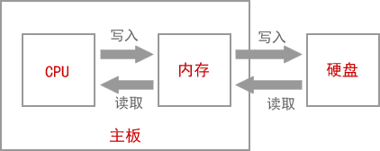

## 数据在内存中的存储

计算机要处理的信息是多种多样的，如数字、文字、符号、图形、音频、视频等，这些信息在人们的眼里是不同的。但对于计算机来说，它们在内存中都是一样的，都是以二进制的形式来表示。

**要想学习编程，就必须了解二进制，它是计算机处理数据的基础。**

内存条是一个非常精密的部件，包含了上亿个电子元器件，它们很小，达到了纳米级别。这些元器件，实际上就是电路；电路的电压会变化，要么是 0V，要么是 5V，只有这两种电压。5V 是通电，用1来表示，0V 是断电，用0来表示。所以，一个元器件有2种状态，0 或者 1。

我们通过电路来控制这些元器件的通断电，会得到很多0、1的组合。例如，8个元器件有 2^8=256 种不同的组合，16个元器件有 2^16=65536 种不同的组合。虽然一个元器件只能表示2个数值，但是多个结合起来就可以表示很多数值了。

一般情况下我们不一个一个的使用元器件，而是将8个元器件看做一个单位，即使表示很小的数，例如 1，也需要8个，也就是 00000001。

1个元器件称为1比特（Bit）或1位，
8个元器件称为1字节（Byte），
那么16个元器件就是2Byte，
32个就是4Byte，
以此类推：

8×1024个元器件就是1024Byte，简写为1KB；
8×1024×1024个元器件就是1024KB，简写为1MB；
8×1024×1024×1024个元器件就是1024MB，简写为1GB。

现在，你知道1GB的内存有多少个元器件了吧。我们通常所说的文件大小是多少 KB、多少 MB，就是这个意思。

单位换算：
- 1Byte = 8 Bit
- 1KB = 1024Byte = 2^10Byte
- 1MB = 1024KB = 2^20Byte
- 1GB = 1024MB = 2^30Byte
- 1TB = 1024GB = 2^40Byte
- 1PB = 1024TB = 2^50Byte
- 1EB = 1024PB = 2^60Byte

我们平时使用计算机时，通常只会设计到 KB、MB、GB、TB 这几个单位，PB 和 EB 这两个高级单位一般在大数据处理过程中才会用到。

你看，在内存中没有abc这样的字符，也没有gif、jpg这样的图片，只有0和1两个数字，计算机也只认识0和1。所以，计算机使用二进制，而不是我们熟悉的十进制，写入内存中的数据，都会被转换成0和1的组合。

## 载入内存，让程序运行起来

如果你的电脑上安装了QQ，你希望和好友聊天，会双击QQ图标，打开QQ软件，输入账号和密码，然后登录就可以了。

那么，QQ是怎么运行起来的呢？

首先，有一点你要明确，你安装的QQ软件是保存在硬盘中的。

双击QQ图标，操作系统就会知道你要运行这个软件，它会在硬盘中找到你安装的QQ软件，将数据（安装的软件本质上就是很多数据的集合）复制到内存。对！就是复制到内存！QQ不是在硬盘中运行的，而是在内存中运行的。

为什么呢？因为内存的读写速度比硬盘快很多。

对于读写速度，内存 > 固态硬盘 > 机械硬盘。机械硬盘是靠电机带动盘片转动来读写数据的，而内存条通过电路来读写数据，电机的转速肯定没有电的传输速度（几乎是光速）快。虽然固态硬盘也是通过电路来读写数据，但是因为与内存的控制方式不一样，速度也不及内存。

所以，不管是运行QQ还是编辑Word文档，都是先将硬盘上的数据复制到内存，才能让CPU来处理，这个过程就叫作**载入内存**。完成这个过程需要一个特殊的程序（软件），这个程序就叫做 **加载器**。

CPU直接与内存打交道，它会读取内存中的数据进行处理，并将结果保存到内存。如果需要保存到硬盘，才会将内存中的数据复制到硬盘。

例如，打开Word文档，输入一些文字，虽然我们看到的不一样了，但是硬盘中的文档没有改变，新增的文字暂时保存到了内存，Ctrl+S才会保存到硬盘。因为内存断电后会丢失数据，所以如果你编辑完Word文档忘记保存就关机了，那么你将永远无法找回这些内容。

### 虚拟内存

如果我们运行的程序较多，占用的空间就会超过内存（内存条）容量。例如计算机的内存容量为2G，却运行着10个程序，这10个程序共占用3G的空间，也就意味着需要从硬盘复制 3G 的数据到内存，这显然是不可能的。

操作系统（Operating System，简称 OS）为我们解决了这个问题：当程序运行需要的空间大于内存容量时，会将内存中暂时不用的数据再写回硬盘；需要这些数据时再从硬盘中读取，并将另外一部分不用的数据写入硬盘。这样，硬盘中就会有一部分空间用来存放内存中暂时不用的数据。这一部分空间就叫做虚拟内存（Virtual Memory）。

3G - 2G = 1G，上面的情况需要在硬盘上分配 1G 的虚拟内存。

硬盘的读写速度比内存慢很多，反复交换数据会消耗很多时间，所以如果你的内存太小，会严重影响计算机的运行速度，甚至会出现”卡死“现象，即使CPU强劲，也不会有大的改观。如果经济条件允许，建议将内存升级为 4G，在 win7、win8、win10 下运行软件就会比较流畅了。

总结：CPU直接从内存中读取数据，处理完成后将结果再写入内存。



## ASCII编码，将英文存储到计算机

前面我们已经讲到，计算机是以二进制的形式来存储数据的，它只认识 0 和 1 两个数字，我们在屏幕上看到的文字，在存储之前都被转换成了二进制（0和1序列），在显示时也要根据二进制找到对应的字符。

可想而知，特定的文字必然对应着固定的二进制，否则在转换时将发生混乱。那么，怎样将文字与二进制对应起来呢？这就需要有一套规范，计算机公司和软件开发者都必须遵守，这样的一套规范就称为**字符集**（Character Set）或者**字符编码**（Character Encoding）。

> 严格来说，字符集和字符编码不是一个概念，字符集定义了**文字和二进制的对应关系**，为字符分配了唯一的编号，而字符编码规定了**如何将文字的编号存储到计算机中**。我们暂时先不讨论这些细节，姑且认为它们是一个概念，本节中我也混用了这两个概念，未做区分。

**字符集为每个字符分配一个唯一的编号，类似于学生的学号，通过编号就能够找到对应的字符。**

可以将字符集理解成一个很大的表格，它列出了所有字符和二进制的对应关系，计算机显示文字或者存储文字，就是一个查表的过程。

在计算机逐步发展的过程中，先后出现了几十种甚至上百种字符集，有些还在使用，有些已经淹没在了历史的长河中，本节我们要讲解的是一种专门针对英文的字符集——ASCII编码。

### 拉丁字母（开胃小菜）

在正式介绍 ASCII 编码之前，我们先来说说什么是拉丁字母。估计也有不少读者和我一样，对于拉丁字母、英文字母和汉语拼音中的字母的关系不是很清楚。

拉丁字母也叫罗马字母，它源自希腊字母，是当今世界上使用最广的字母系统。基本的拉丁字母就是我们经常见到的 ABCD 等26个英文字母。

> 拉丁字母、阿拉伯字母、斯拉夫字母（西里尔字母）被称为世界三大字母体系。

拉丁字母原先是欧洲人使用的，后来由于欧洲殖民主义，导致这套字母体系在全球范围内开始流行，美洲、非洲、澳洲、亚洲都没有逃过西方文化的影响。中国也是，我们现在使用的拼音其实就是拉丁字母，是不折不扣的舶来品。

后来，很多国家对 26 个基本的拉丁字母进行了扩展，以适应本地的语言文化。最常见的扩展方式就是加上变音符号，例如汉语拼音中的`ü`，就是在`u`的基础上加上两个小点演化而来；再如，`áà`就是在`a`的上面标上音调。

总起来说：
基本拉丁字母就是 26 个英文字母；
扩展拉丁字母就是在基本的 26 个英文字母的基础上添加变音符号、横线、斜线等演化而来，每个国家都不一样。

### ASCII 编码

计算机是美国人发明的，他们首先要考虑的问题是，如何将二进制和英文字母（也就是拉丁文）对应起来。

当时，各个厂家或者公司都有自己的做法，编码规则并不统一，这给不同计算机之间的数据交换带来不小的麻烦。但是相对来说，能够得到普遍认可的有 IBM 发明的 EBCDIC 和此处要谈的 ASCII。

我们先说 ASCII。ASCII 是“American Standard Code for Information Interchange”的缩写，翻译过来是“美国信息交换标准代码”。看这个名字就知道，这套编码是美国人给自己设计的，他们并没有考虑欧洲那些扩展的拉丁字母，也没有考虑韩语和日语，我大中华几万个汉字更是不可能被重视。

但这也无可厚非，美国人自己发明的计算机，当然要先解决自己的问题

ASCII 的标准版本于 1967 年第一次发布，最后一次更新则是在 1986 年，迄今为止共收录了 128 个字符，包含了基本的拉丁字母（英文字母）、阿拉伯数字（也就是 1234567890）、标点符号（`,.!`等）、特殊符号（`@#$%^&`等）以及一些具有控制功能的字符（往往不会显示出来）。

在 ASCII 编码中，大写字母、小写字母和阿拉伯数字都是连续分布的（见下表），这给程序设计带来了很大的方便。例如要判断一个字符是否是大写字母，就可以判断该字符的 ASCII 编码值是否在 65~90 的范围内。

EBCDIC 编码正好相反，它的英文字母不是连续排列的，中间出现了多次断续，给编程带来了一些困难。现在连 IBM 自己也不使用 EBCDIC 了，转而使用更加优秀的 ASCII。

ASCII 编码已经成了计算机的通用标准，没有人再使用 EBCDIC 编码了，它已经消失在历史的长河中了。

标准的 ASCII 编码共收录了 128 个字符，用一个字节中较低的 7 个比特位（Bit）足以表示（2^7 = 128），所以还会空闲下一个比特位，它就被浪费了。

### ASCII 编码和C语言
稍微有点C语言基本功的读者可能认为C语言使用的就是 ASCII 编码，字符在存储时会转换成对应的 ASCII 码值，在读取时也是根据 ASCII 码找到对应的字符。
这句话是错误的，严格来说，你可能被大学老师和C语言教材给误导了。

## GB2312编码和GBK编码，将中文存储到计算机

计算机是一种改变世界的发明，很快就从美国传到了全球各地，得到了所有国家的认可，成为了一种不可替代的工具。计算机在广泛流行的过程中遇到的一个棘手问题就是字符编码，计算机是美国人发明的，它使用的是 ASCII 编码，只能显示英文字符，对汉语、韩语、日语、法语、德语等其它国家的字符无能为力。

为了让本国公民也能使用上计算机，各个国家（地区）也开始效仿 ASCII，开发了自己的字符编码。这些字符编码和 ASCII 一样，只考虑本国的语言文化，不兼容其它国家的文字。这样做的后果就是，一台计算机上必须安装多套字符编码，否则就不能正确地跨国传递数据，例如在中国编写的文本文件，拿到日本的电脑上就无法打开，或者打开后是一堆乱码。

下表列出了常见的字符编码：

|字符编码|说明|
|--|--|
|ISO/IEC 8859|	欧洲字符集，支持丹麦语、荷兰语、德语、意大利语、拉丁语、挪威语、葡萄牙语、西班牙语，瑞典语等，1987 年首次发布。|
|ASCII|编码只包含了基本的拉丁字母，没有包含欧洲很多国家所用到的一些扩展的拉丁字母，比如一些重音字母，带音标的字母等，ISO/IEC 8859 主要是在 ASCII 的基础上增加了这些衍生的拉丁字母。|
|Shift_Jis|日语字符集，包含了全角及半角拉丁字母、平假名、片假名、符号及日语汉字，1978 年首次发布。|
|Big5|繁体中文字符集，1984 年发布，通行于台湾、香港等地区，收录了 13053 个中文字、408个普通字符以及 33 个控制字符。|
|GB2312|简体中文字符集，1980 年发布，共收录了 6763 个汉字，其中一级汉字 3755 个，二级汉字 3008 个；同时收录了包括拉丁字母、希腊字母、日文平假名及片假名字母、俄语西里尔字母在内的 682 个字符。|
|GBK|中文字符集，是在 GB2312 的基础上进行的扩展，1995 年发布。|
|GB2312|收录的汉字虽然覆盖了中国大陆 99.75% 的使用频率，满足了基本的输入输出要求，但是对于人名、古汉语等方面出现的罕用字（例如朱镕基的“镕”就没有被 GB2312 收录），GB2312 并不能处理，所以后来又对 GBK 进行了一次扩展，形成了一种新的字符集，就是 GBK。|
|GBK|共收录了 21886 个汉字和图形符号，包括 GB2312 中的全部汉字、非汉字符号，以及 BIG5 中的全部繁体字，还有一些生僻字。|
|GB18030|中文字符集，是对 GBK 和 GB2312 的又一次扩展，2000 年发布。|
|GB18030|共收录 70244 个汉字，支持中国国内少数民族的文字，以及日语韩语中的汉字。|

由于 ASCII 先入为主，已经使用了十来年了，现有的很多软件和文档都是基于 ASCII 的，所以后来的这些字符编码都是在 ASCII 基础上进行的扩展，它们都兼容 ASCII，以支持既有的软件和文档。

**兼容 ASCII 的含义是，原来 ASCII 中已经包含的字符，在国家编码（地区编码）中的位置不变（也就是编码值不变），只是在这些字符的后面增添了新的字符。**

### 如何存储

标准 ASCII 编码共包含了 128 个字符，用一个字节就足以存储（实际上是用一个字节中较低的 7 位来存储），而日文、中文、韩文等包含的字符非常多，有成千上万个，一个字节肯定是不够的（一个字节最多存储 2^8 = 256 个字符），所以要进行扩展，用两个、三个甚至四个字节来表示。

在制定字符编码时还要考虑内存利用率的问题。我们经常使用的字符，其编码值一般都比较小，例如字母和数字都是 ASCII 编码，其编码值不会超过 127，用一个字节存储足以，如果硬要用多个字节存储，就会浪费很多内存空间。

为了达到「既能存储本国字符，又能节省内存」的目的，Shift-Jis、Big5、GB2312 等都采用变长的编码方式：

- 对于原来的 ASCII 编码部分，用一个字节存储足以；
- 对于本国的常用字符（例如汉字、标点符号等），一般用两个字节存储；
- 对于偏远地区，或者极少使用的字符（例如藏文、蒙古文等），才使用三个甚至四个字节存储。

总起来说，越常用的字符占用的内存越少，越罕见的字符占用的内存越多。

#### 具体讲一下中文编码方案

GB2312 --> GBK --> GB18030 是中文编码的三套方案，出现的时间从早到晚，收录的字符数目依次增加，并且向下兼容。GB2312 和 GBK 收录的字符数目较少，用 1~2个字节存储；GB18030 收录的字符最多，用1、2、4 个字节存储。

1) 从整体上讲，GB2312 和 GBK 的编码方式一致，具体为：

- 对于 ASCII 字符，使用一个字节存储，并且该字节的最高位是 0，这和 ASCII 编码是一致的，所以说 GB2312 完全兼容 ASCII。
- 对于中国的字符，使用两个字节存储，并且规定每个字节的最高位都是 1。

例如对于字母`A`，它在内存中存储为 `01000001`；对于汉字中，它在内存中存储为`1101011011010000`。由于单字节和双字节的最高位不一样，所以字符处理软件很容易区分一个字符到底用了几个字节。

2) GB18030 为了容纳更多的字符，并且要区分两个字节和四个字节，所以修改了编码方案，具体为：

- 对于 ASCII 字符，使用一个字节存储，并且该字节的最高位是 0，这和 ASCII、GB2312、GBK 编码是一致的。
- 对于常用的中文字符，使用两个字节存储，并且规定第一个字节的最高位是 1，第二个字节的高位最多只能有一个连续的 0（第二个字节的最高位可以是 1 也可以是 0，但是当它是 0 时，次高位就不能是 0 了）。注意对比 GB2312 和 GBK，它们要求两个字节的最高位为都必须为 1。
- 对于罕见的字符，使用四个字节存储，并且规定第一个和第三个字节的最高位是 1，第二个和第四个字节的高位必须有两个连续的 0。

例如对于字母`A`，它在内存中存储为 `01000001`；对于汉字中，它在内存中存储为 `11010110  11010000`；对于藏文གྱུ，它在内存中的存储为`10000001  00110010  11101111  00110000`。

字符处理软件在处理文本时，从左往右依次扫描每个字节：

- 如果遇到的字节的最高位是 0，那么就会断定该字符只占用了一个字节；
- 如果遇到的字节的最高位是 1，那么该字符可能占用了两个字节，也可能占用了四个字节，不能妄下断论，所以还要继续往后扫描：
- 如果第二个字节的高位有两个连续的 0，那么就会断定该字符占用了四个字节；
- 如果第二个字节的高位没有连续的 0，那么就会断定该字符占用了两个字节。

可见，当字符占用两个或者四个字节时，GB18030 编码要检测两次，处理效率比 GB2312 和 GBK 都低。

## GBK 编码最牛掰
**GBK 于 1995 年发布，这一年也是互联网爆发的元年，国人使用电脑越来越多，也许是 GBK 这头猪正好站在风口上，它就飞起来了，后来的中文版 Windows 都将 GBK 作为默认的中文编码方案。**

注意，这里我说 GBK 是默认的中文编码方案，并没有说 Windows 默认支持 GBK。Windows 在内核层面使用的是 Unicode 字符集（严格来说是 UTF-16 编码），但是它也给用户留出了选择的余地，如果用户不希望使用 Unicode，而是希望使用中文编码方案，那么这个时候 Windows 默认使用 GBK（当然，你可以选择使用 GB2312 或者 GB18030，不过一般没有这个必要）。

```
下节我们会讲解 Unicode 字符集和 UTF-16 编码方案。
```

实际上，中文版 Windows 下的很多程序默认使用的就是 GBK 编码，例如用记事本程序创建一个 txt 文档、在 cmd 或者控制台程序（最常见的C语言程序）中显示汉字、用 Visual Studio 创建的源文件等，使用的都是 GBK 编码。

**可以说，GBK 编码在中文版的 Windows 中大行其道。**

## Unicode字符集，将全世界的文字存储到计算机

ASCII、GB2312、GBK、Shift_Jis、ISO/IEC 8859 等地区编码都是各个国家为了自己的语言文化开发的，不具有通用性，在一种编码下开发的软件或者编写的文档，拿到另一种编码下就会失效，必须提前使用程序转码，非常麻烦。

人们迫切希望有一种编码能够统一世界各地的字符，计算机只要安装了这一种字编码，就能支持使用世界上所有的文字，再也不会出现乱码，再也不需要转码了，这对计算机的数据传递来说是多么的方便呀！

就在这种呼吁下，Unicode 诞生了。Unicode 也称为**统一码、万国码**；看名字就知道，Unicode 希望统一所有国家的字符编码。

Unicode 于 1994 年正式公布第一个版本，现在的规模可以容纳 100 多万个符号，是一个很大的集合。

>有兴趣的读取可以转到 https://unicode-table.com/cn/ 查看 Unicode 包含的所有字符，以及各个国家的字符是如何分布的。
> 这个网站不太稳定，随时可能无法访问，不要问我为什么，访问不了也不要找我，没有比它更好的网站了。

**Windows、Linux、Mac OS 等常见操作系统都已经从底层（内核层面）开始支持 Unicode，大部分的网页和软件也使用 Unicode，Unicode 是大势所趋。**

不过由于历史原因，目前的计算机仍然安装了 ASCII 编码以及 GB2312、GBK、Big5、Shift-JIS 等地区编码，以支持不使用 Unicode 的软件或者文档。内核在处理字符时，一般会将地区编码先转换为 Unicode，再进行下一步处理。

### Unicode 字符集是如何存储的

本节我们多次说 Unicode 是一套字符集，而不是一套字符编码，它们之间究竟有什么区别呢？

严格来说，字符集和字符编码不是一个概念：

- 字符集定义了字符和二进制的对应关系，为每个字符分配了唯一的编号。可以将字符集理解成一个很大的表格，它列出了所有字符和二进制的对应关系，计算机显示文字或者存储文字，就是一个查表的过程。
- 而字符编码规定了如何将字符的编号存储到计算机中。如果使用了类似 GB2312 和 GBK 的变长存储方案（不同的字符占用的字节数不一样），那么为了区分一个字符到底使用了几个字节，就不能将字符的编号直接存储到计算机中，字符编号在存储之前必须要经过转换，在读取时还要再逆向转换一次，这套转换方案就叫做字符编码。

有的字符集在制定时就考虑到了编码的问题，是和编码结合在一起的，例如 **ASCII、GB2312、GBK、BIG5 等，所以无论称作字符集还是字符编码都无所谓，也不好区分两者的概念。而有的字符集只管制定字符的编号，至于怎么存储，那是字符编码的事情，Unicode 就是一个典型的例子，它只是定义了全球文字的唯一编号，我们还需要 UTF-8、UTF-16、UTF-32 这几种编码方案将 Unicode 存储到计算机中。**

#### 注意区分以下

Unicode 可以使用的编码方案有三种，分别是：

- UTF-8：一种变长的编码方案，使用 1~6 个字节来存储；
- UTF-16：介于 UTF-8 和 UTF-32 之间，使用 2 个或者 4 个字节来存储，长度既固定又可变。
- UTF-32：一种固定长度的编码方案，不管字符编号大小，始终使用 4 个字节来存储；

UTF 是 Unicode Transformation Format 的缩写，意思是“Unicode转换格式”，后面的数字表明至少使用多少个比特位（Bit）来存储字符。

#### 1) UTF-8
UTF-8 的编码规则很简单：

- 如果只有一个字节，那么最高的比特位为 0，这样可以兼容 ASCII；
- 如果有多个字节，那么第一个字节从最高位开始，连续有几个比特位的值为 1，就使用几个字节编码，剩下的字节均以 10 开头。

具体的表现形式为：

- 0xxxxxxx：单字节编码形式，这和 ASCII 编码完全一样，因此 UTF-8 是兼容 ASCII 的；
- 110xxxxx 10xxxxxx：双字节编码形式（第一个字节有两个连续的 1）；
- 1110xxxx 10xxxxxx 10xxxxxx：三字节编码形式（第一个字节有三个连续的 1）；
- 11110xxx 10xxxxxx 10xxxxxx 10xxxxxx：四字节编码形式（第一个字节有四个连续的 1）。

xxx 就用来存储 Unicode 中的字符编号。

下面是一些字符的 UTF-8 编码实例（绿色部分表示本来的 Unicode 编号）：

|字符|字母 N|符号 æ|中文 ⻬|
|--|--|--|--|
|Unicode 编号（二进制）|01001110|11100110|00101110 11101100|
|Unicode 编号（十六进制）|4E|E6|2E EC|
|UTF-8 编码（二进制）|01001110|11000011 10100110|11100010 10111011 10101100|
|UTF-8 编码（十六进制）|4E|C3 A6|E2 BB AC|

对于常用的字符，它的 Unicode 编号范围是 0 ~ FFFF，用1~3 个字节足以存储，只有及其罕见，或者只有少数地区使用的字符才需要 4~6个字节存储。

#### 2) UTF-32
UTF-32 是固定长度的编码，始终占用 4 个字节，足以容纳所有的 Unicode 字符，所以直接存储 Unicode 编号即可，不需要任何编码转换。浪费了空间，提高了效率。
#### 3) UTF-16
UFT-16 比较奇葩，它使用 2 个或者 4 个字节来存储。

对于 Unicode 编号范围在 0 ~ FFFF 之间的字符，UTF-16 使用两个字节存储，并且直接存储 Unicode 编号，不用进行编码转换，这跟 UTF-32 非常类似。

对于 Unicode 编号范围在 10000~10FFFF 之间的字符，UTF-16 使用四个字节存储，具体来说就是：将字符编号的所有比特位分成两部分，较高的一些比特位用一个值介于 D800~DBFF 之间的双字节存储，较低的一些比特位（剩下的比特位）用一个值介于 DC00~DFFF 之间的双字节存储。

如果你不理解什么意思，请看下面的表格：

|Unicode 编号范围（十六进制)|具体的 Unicode 编号（二进制）|UTF-16 编码|编码后的字节数|
|----|----|----|----|
|0000 0000 ~ 0000 FFFF|xxxxxxxx xxxxxxxx|xxxxxxxx xxxxxxxx|2|
|0001 0000---0010 FFFF|yyyy yyyy yyxx xxxx xxxx|110110yy yyyyyyyy 110111xx xxxxxxxx|4|
位于 D800~0xDFFF 之间的 Unicode 编码是特别为四字节的 UTF-16 编码预留的，所以不应该在这个范围内指定任何字符。如果你真的去查看 Unicode 字符集，会发现这个区间内确实没有收录任何字符。

UTF-16 要求在制定 Unicode 字符集时必须考虑到编码问题，所以真正的 Unicode 字符集也不是随意编排字符的。

### 对比以上三种编码方案
首先，只有 UTF-8 兼容 ASCII，UTF-32 和 UTF-16 都不兼容 ASCII，因为它们没有单字节编码。

1) UTF-8 使用尽量少的字节来存储一个字符，不但能够节省存储空间，而且在网络传输时也能节省流量，所以很多纯文本类型的文件（例如各种编程语言的源文件、各种日志文件和配置文件等）以及绝大多数的网页（例如百度、新浪、163等）都采用 UTF-8 编码。

UTF-8 的缺点是效率低，不但在存储和读取时都要经过转换，而且在处理字符串时也非常麻烦。例如，要在一个 UTF-8 编码的字符串中找到第 10 个字符，就得从头开始一个一个地检索字符，这是一个很耗时的过程，因为 UTF-8 编码的字符串中每个字符占用的字节数不一样，如果不从头遍历每个字符，就不知道第 10 个字符位于第几个字节处，就无法定位。

不过，随着算法的逐年精进，UTF-8 字符串的定位效率也越来越高了，往往不再是槽点了。

2) UTF-32 是“以空间换效率”，正好弥补了 UTF-8 的缺点，UTF-32 的优势就是效率高：UTF-32 在存储和读取字符时不需要任何转换，在处理字符串时也能最快速地定位字符。例如，在一个 UTF-32 编码的字符串中查找第 10 个字符，很容易计算出它位于第 37 个字节处，直接获取就行，不用再逐个遍历字符了，没有比这更快的定位字符的方法了。

但是，UTF-32 的缺点也很明显，就是太占用存储空间了，在网络传输时也会消耗很多流量。我们平常使用的字符编码值一般都比较小，用一两个字节存储足以，用四个字节简直是暴殄天物，甚至说是不能容忍的，所以 UTF-32 在应用上不如 UTF-8 和 UTF-16 广泛。

3) UTF-16 可以看做是 UTF-8 和 UTF-32 的折中方案，它平衡了存储空间和处理效率的矛盾。对于常用的字符，用两个字节存储足以，这个时候 UTF-16 是不需要转换的，直接存储字符的编码值即可。

**Windows 内核、.NET Framework、Cocoa、Java String 内部采用的都是 UTF-16 编码。UTF-16 是幕后的功臣，我们在编辑源代码和文档时都是站在前台，所以一般感受不到，其实很多文本在后台处理时都已经转换成了 UTF-16 编码。**

不过，UNIX 家族的操作系统（Linux、Mac OS、iOS 等）内核都采用 UTF-8 编码，我们就不去争论谁好谁坏了。

### 宽字符和窄字符（多字节字符）

有的编码方式采用 1~n 个字节存储，是变长的，例如 UTF-8、GB2312、GBK 等；如果一个字符使用了这种编码方式，我们就将它称为多字节字符，或者窄字符。

有的编码方式是固定长度的，不管字符编号大小，始终采用 n 个字节存储，例如 UTF-32、UTF-16 等；如果一个字符使用了这种编码方式，我们就将它称为宽字符。

Unicode 字符集可以使用窄字符的方式存储，也可以使用宽字符的方式存储；GB2312、GBK、Shift-JIS 等国家编码一般都使用窄字符的方式存储；ASCII 只有一个字节，无所谓窄字符和宽字符。
