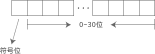
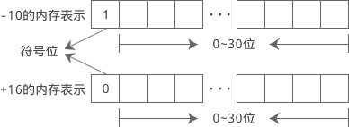
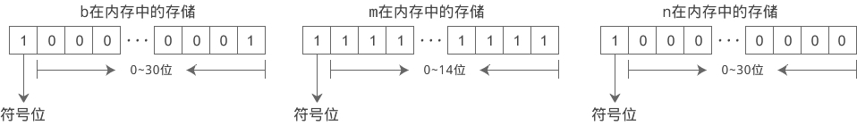

## 大话C语言变量和数据类型

在《二进制思想以及数据的存储》一节中讲到：

- 计算机要处理的数据（诸如数字、文字、符号、图形、音频、视频等）是以二进制的形式存放在内存中的；
- 我们将8个比特（Bit）称为一个字节（Byte），并将字节作为最小的可操作单元。

我们不妨先从最简单的整数说起，看看它是如何放到内存中去的。

### 变量（Variable）

现实生活中我们会找一个小箱子来存放物品，一来显得不那么凌乱，二来方便以后找到。计算机也是这个道理，我们需要先在内存中找一块区域，规定用它来存放整数，并起一个好记的名字，方便以后查找。这块区域就是“小箱子”，我们可以把整数放进去了。

C语言中这样在内存中找一块区域：
```
int a;
```

`int`又是一个新单词，它是 Integer 的简写，意思是整数。a 是我们给这块区域起的名字；当然也可以叫其他名字，例如 abc、mn123 等。

这个语句的意思是：在内存中找一块区域，命名为 a，用它来存放整数。

> 注意 int 和 a 之间是有空格的，它们是两个词。也注意最后的分号，int a表达了完整的意思，是一个语句，要用分号来结束。

不过int a;仅仅是在内存中找了一块可以保存整数的区域，那么如何将 123、100、999 这样的数字放进去呢？

C语言中这样向内存中放整数：
```
a=123;
```
`=`是一个新符号，它在数学中叫“等于号”，例如 1+2=3，但在C语言中，这个过程叫做赋值（Assign）。赋值是指把数据放到内存的过程。

把上面的两个语句连起来：
```
int a;
a=123;
```
就把 123 放到了一块叫做 a 的内存区域。你也可以写成一个语句：
```
int a=123;
```
a 中的整数不是一成不变的，只要我们需要，随时可以更改。更改的方式就是再次赋值，例如：
```
int a=123;
a=1000;
a=9999;
```

第二次赋值，会把第一次的数据覆盖（擦除）掉，也就是说，a 中最后的值是9999，123、1000 已经不存在了，再也找不回来了。

因为 a 的值可以改变，所以我们给它起了一个形象的名字，叫做变量（Variable）。

int a;创造了一个变量 a，我们把这个过程叫做变量定义。a=123;把 123 交给了变量 a，我们把这个过程叫做给变量赋值；又因为是第一次赋值，也称变量的初始化，或者赋初值。

你可以先定义变量，再初始化，例如：
```
int abc;
abc=999;
```
也可以在定义的同时进行初始化，例如：
```
int abc=999;
```
这两种方式是等价的。

### 数据类型（Data Type）

数据是放在内存中的，变量是给这块内存起的名字，有了变量就可以找到并使用这份数据。但问题是，该如何使用呢？

我们知道，诸如数字、文字、符号、图形、音频、视频等数据都是以二进制形式存储在内存中的，它们并没有本质上的区别，那么，00010000 该理解为数字16呢，还是图像中某个像素的颜色呢，还是要发出某个声音呢？如果没有特别指明，我们并不知道。

也就是说，内存中的数据有多种解释方式，使用之前必须要确定；上面的int a;就表明，这份数据是整数，不能理解为像素、声音等。int 有一个专业的称呼，叫做数据类型（Data Type）。

**顾名思义，数据类型用来说明数据的类型，确定了数据的解释方式，让计算机和程序员不会产生歧义。** 在C语言中，有多种数据类型，例如：

|说  明|字符型|短整型|整型|长整型|单精度浮点型|双精度浮点型|无类型|
|--|--|--|--|--|--|--|--|
|数据类型|char|short|int|long|float|double|void|

这些是最基本的数据类型，是C语言自带的，如果我们需要，还可以通过它们组成更加复杂的数据类型，后面我们会一一讲解。

### 连续定义多个变量

为了让程序的书写更加简洁，C语言支持多个变量的连续定义，例如：
```
int a, b, c;
float m = 10.9, n = 20.56;
char p, q = '@';
```
连续定义的多个变量以逗号,分隔，并且要拥有相同的数据类型；变量可以初始化，也可以不初始化。

### 数据的长度（Length）

所谓数据长度（Length），是指数据占用多少个字节。占用的字节越多，能存储的数据就越多，对于数字来说，值就会更大，反之能存储的数据就有限。

多个数据在内存中是连续存储的，彼此之间没有明显的界限，如果不明确指明数据的长度，计算机就不知道何时存取结束。例如我们保存了一个整数 1000，它占用4个字节的内存，而读取时却认为它占用3个字节或5个字节，这显然是不正确的。

所以，在定义变量时还要指明数据的长度。而这恰恰是数据类型的另外一个作用。数据类型除了指明数据的解释方式，还指明了数据的长度。**因为在C语言中，每一种数据类型所占用的字节数都是固定的，知道了数据类型，也就知道了数据的长度。**

在32位环境中，各种数据类型的长度一般如下：

|说明|字符型|短整型|整型|长整型|单精度浮点型|双精度浮点型|
|--|--|--|--|--|--|--|--|--|
|数据类型|char|short|int|long|float|double|
|长度|1|2|4|4|4|8|

C语言有多少种数据类型，每种数据类型长度是多少、该如何使用，这是每一位C程序员都必须要掌握的，后续我们会一一讲解。

### 最后的总结

数据是放在内存中的，在内存中存取数据要明确三件事情：数据存储在哪里、数据的长度以及数据的处理方式。

变量名不仅仅是为数据起了一个好记的名字，还告诉我们数据存储在哪里，使用数据时，只要提供变量名即可；而数据类型则指明了数据的长度和处理方式。所以诸如int n;、char c;、float money;这样的形式就确定了数据在内存中的所有要素。

C语言提供的多种数据类型让程序更加灵活和高效，同时也增加了学习成本。而有些编程语言，例如PHP、JavaScript等，在定义变量时不需要指明数据类型，编译器会根据赋值情况自动推演出数据类型，更加智能。

除了C语言，Java、C++、C#等在定义变量时也必须指明数据类型，这样的编程语言称为强类型语言。而PHP、JavaScript等在定义变量时不必指明数据类型，编译系统会自动推演，这样的编程语言称为弱类型语言。

强类型语言一旦确定了数据类型，就不能再赋给其他类型的数据，除非对数据类型进行转换。弱类型语言没有这种限制，一个变量，可以先赋给一个整数，然后再赋给一个字符串。

最后需要说明的是：数据类型只在定义变量时指明，而且必须指明；使用变量时无需再指明，因为此时的数据类型已经确定了。

## 在屏幕上输出各种类型的数据

printf 比 puts 更加强大，不仅可以输出字符串，还可以输出整数、小数、单个字符等，并且输出格式也可以自己定义，例如：

- 以十进制、八进制、十六进制形式输出；
- 要求输出的数字占 n 个字符的位置；
- 控制小数的位数。

**printf 是 print format 的缩写，意思是“格式化打印”。这里所谓的“打印”就是在屏幕上显示内容，与“输出”的含义相同，所以我们一般称 printf 是用来格式化输出的。**

先来看一个简单的例子：
```
printf("HelloWorld");
```
这个语句可以在屏幕上显示“HelloWorld”，与puts("HelloWorld");的效果类似。

输出变量 abc 的值：
```
int abc=999;
printf("%d", abc);
```
这里就比较有趣了。先来看%d，**d 是 decimal 的缩写，意思是十进制数，%d 表示以十进制整数的形式输出。** 输出什么呢？输出变量 abc 的值。%d 与 abc 是对应的，也就是说，会用 abc 的值来替换 %d。

再来看个复杂点的：
```
int abc=999;
printf("The value of abc is %d !", abc);
```
会在屏幕上显示：
`The value of abc is 999 !``

你看，字符串 "The value of abc is %d !" 中的 %d 被替换成了 abc 的值，其他字符没有改变。这说明 %d 比较特殊，不会原样输出，会被替换成对应的变量的值。

再来看：
```
int a=100;
int b=200;
int c=300;
printf("a=%d, b=%d, c=%d", a, b, c);
```
会在屏幕上显示：
```
a=100, b=200, c=300
```

再次证明了 %d 与后面的变量是一一对应的，第一个 %d 对应第一个变量，第二个 %d 对应第二个变量……

%d称为格式控制符，它指明了以何种形式输出数据。格式控制符均以%开头，后跟其他字符。%d 表示以十进制形式输出一个整数。除了 %d，printf 支持更多的格式控制，例如：

- %c：输出一个字符。c 是 character 的简写。
- %s：输出一个字符串。s 是 string 的简写。
- %f：输出一个小数。f 是 float 的简写。

```C
#include <stdio.h>
int main()
{
    int n = 100;
    char c = '@';  //字符用单引号包围，字符串用双引号包围
    float money = 93.96;
    printf("n=%d, c=%c, money=%f\n", n, c, money);
    return 0;
}
```
输出结果：
```
n=100, c=@, money=93.959999
```

要点提示：
1) \n是一个整体，组合在一起表示一个换行字符。换行符是 ASCII 编码中的一个控制字符，无法在键盘上直接输入，只能用这种特殊的方法表示，被称为转义字符，我们将在《C语言转义字符》一节中有具体讲解，请大家暂时先记住\n的含义。

> 所谓换行，就是让文本从下一行的开头输出，相当于在编辑 Word 或者 TXT 文档时按下回车键。

puts 输出完成后会自动换行，而 printf 不会，要自己添加换行符，这是 puts 和 printf 在输出字符串时的一个区别。

2) //后面的为注释。注释用来说明代码是什么意思，起到提示的作用，可以帮助我们理解代码。注释虽然也是代码的一部分，但是它并不会给程序带来任何影响，编译器在编译阶段会忽略注释的内容，或者说删除注释的内容。我们将在《C语言标识符、关键字和注释》一节中详细讲解。

3) money 的输出值并不是 93.96，而是一个非常接近的值，这与小数本身的存储机制有关，这种机制导致很多小数不能被精确地表示，即使像 93.96 这种简单的小数也不行。我们将在《小数在内存中是如何存储的，揭秘诺贝尔奖级别的设计（长篇神文）》一节详细介绍。

我们也可以不用变量，将数据直接输出：
```
#include <stdio.h>
int main()
{
    float money = 93.96;
    printf("n=%d, c=%c, money=%f\n", 100, '@', money);
    return 0;
}
```

输出结果与上面相同。

在以后的编程中，我们会经常使用 printf，说它是C语言中使用频率最高的一个函数一点也不为过，每个C语言程序员都应该掌握 printf 的用法，这是最基本的技能。

不过 printf 的用法比较灵活，也比较复杂，初学者知识储备不足，不能一下子掌握，目前大家只需要掌握最基本的用法，以后随着编程知识的学习，我们会逐步介绍更加高级的用法，最终让大家完全掌握 printf。

### 【脑筋急转弯】%ds输出什么

%d 输出整数，%s 输出字符串，那么 %ds 输出什么呢？

我们不妨先来看一个例子：
```c
#include <stdio.h>
int main()
{
    int a=1234;
    printf("a=%ds\n", a);
    return 0;
}
```
运行结果：
```
a=1234s
```

从输出结果可以发现，%d被替换成了变量 a 的值，而s没有变，原样输出了。这是因为， %d才是格式控制符，%ds在一起没有意义，s仅仅是跟在%d后面的一个普通字符，所以会原样输出。

## C语言中的整数（short,int,long）

整数是编程中常用的一种数据，C语言通常使用int来定义整数（int 是 integer 的简写），这在《大话C语言变量和数据类型》中已经进行了详细讲解。

在现代操作系统中，int 一般占用 4 个字节（Byte）的内存，共计 32 位（Bit）。如果不考虑正负数，当所有的位都为 1 时它的值最大，为 `2^32-1 = 4,294,967,295 ≈ 43亿`，这是一个很大的数，实际开发中很少用到，而诸如 1、99、12098 等较小的数使用频率反而较高。

使用 4 个字节保存较小的整数绰绰有余，会空闲出两三个字节来，这些字节就白白浪费掉了，不能再被其他数据使用。现在个人电脑的内存都比较大了，配置低的也有 2G，浪费一些内存不会带来明显的损失；而在C语言被发明的早期，或者在单片机和嵌入式系统中，内存都是非常稀缺的资源，所有的程序都在尽力节省内存。

反过来说，43 亿虽然已经很大，但要表示全球人口数量还是不够，必须要让整数占用更多的内存，才能表示更大的值，比如占用 6 个字节或者 8 个字节。

让整数占用更少的内存可以在 int 前边加 short，让整数占用更多的内存可以在 int 前边加 long，例如：

```
short int a = 10;
short int b, c = 99;
long int m = 102023;
long int n, p = 562131;
```

**这样 a、b、c 只占用 2 个字节的内存，而 m、n、p 可能会占用 8 个字节的内存。**

也可以将 int 省略，只写 short 和 long，如下所示：
```
short a = 10;
short b, c = 99;
long m = 102023;
long n, p = 562131;
```
这样的写法更加简洁，实际开发中常用。

int 是基本的整数类型，short 和 long 是在 int 的基础上进行的扩展，short 可以节省内存，long 可以容纳更大的值。

**short、int、long 是C语言中常见的整数类型，其中 int 称为整型，short 称为短整型，long 称为长整型。**

### 整型的长度

细心的读者可能会发现，上面我们在描述 short、int、long 类型的长度时，只对 short 使用肯定的说法，而对 int、long 使用了“一般”或者“可能”等不确定的说法。这种描述的言外之意是，只有 short 的长度是确定的，是两个字节，而 int 和 long 的长度无法确定，在不同的环境下有不同的表现。

> 一种数据类型占用的字节数，称为该数据类型的长度。例如，short 占用 2 个字节的内存，那么它的长度就是 2。

实际情况也确实如此，C语言并没有严格规定 short、int、long 的长度，只做了宽泛的限制：

- short 至少占用 2 个字节。
- int 建议为**一个机器字长**。32 位环境下机器字长为 4 字节，64 位环境下机器字长为 8 字节。
- short 的长度不能大于 int，long 的长度不能小于 int。

总结起来，它们的长度（所占字节数）关系为：

```
2 ≤ short ≤ int ≤ long

```
**这就意味着，short 并不一定真的”短“，long 也并不一定真的”长“，它们有可能和 int 占用相同的字节数。**

在 16 位环境下，short 的长度为 2 个字节，int 也为 2 个字节，long 为 4 个字节。16 位环境多用于单片机和低级嵌入式系统，在PC和服务器上已经见不到了。

对于 32 位的 Windows、Linux 和 Mac OS，short 的长度为 2 个字节，int 为 4 个字节，long 也为 4 个字节。PC和服务器上的 32 位系统占有率也在慢慢下降，嵌入式系统使用 32 位越来越多。

在 64 位环境下，不同的操作系统会有不同的结果，如下所示：

|操作系统|short|int|long|
|--|--|--|
|Win64（64位 Windows）|2|4|4|
|类Unix系统（包括 Unix、Linux、Mac OS、BSD、Solaris 等）|2|4|8|

目前我们使用较多的PC系统为 Win XP、Win 7、Win 8、Win 10、Mac OS、Linux，在这些系统中，short 和 int 的长度都是固定的，分别为 2 和 4，大家可以放心使用，只有 long 的长度在 Win64 和类 Unix 系统下会有所不同，使用时要注意移植性。

sizeof 操作符

获取某个数据类型的长度可以使用 sizeof 操作符，如下所示：

```c
#include <stdio.h>
int main()
{
    short a = 10;
    int b = 100;

    int short_length = sizeof a;
    int int_length = sizeof(b);
    int long_length = sizeof(long);
    int char_length = sizeof(char);

    printf("short=%d, int=%d, long=%d, char=%d\n", short_length, int_length, long_length, char_length);

    return 0;
}
```
在 32 位环境以及 Win64 环境下的运行结果为：
`short=2, int=4, long=4, char=1`

在 64 位 Linux 和 Mac OS 下的运行结果为：
`short=2, int=4, long=8, char=1`

sizeof 用来获取某个数据类型或变量所占用的字节数，如果后面跟的是变量名称，那么可以省略( )，如果跟的是数据类型，就必须带上( )。

**需要注意的是，sizeof 是C语言中的操作符，不是函数，所以可以不带( )**，后面会详细讲解。

### 不同整型的输出

使用不同的格式控制符可以输出不同类型的整数，它们分别是：

- %hd用来输出 short int 类型，hd 是 short decimal 的简写；
- %d用来输出 int 类型，d 是 decimal 的简写；
- %ld用来输出 long int 类型，ld 是 long decimal 的简写。

下面的例子演示了不同整型的输出：
```C
#include <stdio.h>
int main()
{
    short a = 10;
    int b = 100;
    long c = 9437;
    printf("a=%hd, b=%d, c=%ld\n", a, b, c);
    return 0;
}
```
运行结果：
a=10, b=100, c=9437

在编写代码的过程中，我建议将格式控制符和数据类型严格对应起来，养成良好的编程习惯。当然，如果你不严格对应，一般也不会导致错误，例如，很多初学者都使用%d输出所有的整数类型，请看下面的例子：
```C
#include <stdio.h>
int main()
{
    short a = 10;
    int b = 100;
    long c = 9437;

    printf("a=%d, b=%d, c=%d\n", a, b, c);
    return 0;
}
```
运行结果仍然是：
a=10, b=100, c=9437

当使用%d输出 short，或者使用%ld输出 short、int 时，不管值有多大，都不会发生错误，因为格式控制符足够容纳这些值。

当使用%hd输出 int、long，或者使用%d输出 long 时，如果要输出的值比较小（就像上面的情况），一般也不会发生错误，如果要输出的值比较大，就很有可能发生错误，例如：

```C
#include <stdio.h>
int main()
{
    int m = 306587;
    long n = 28166459852;
    printf("m=%hd, n=%hd\n", m, n);
    printf("n=%d\n", n);
    return 0;
}
```
在 64 位 Linux 和 Mac OS 下（long 的长度为 8）的运行结果为：
```
m=-21093, n=4556
n=-1898311220
```

输出结果完全是错误的，这是因为%hd容纳不下 m 和 n 的值，%d也容纳不下 n 的值。

读者需要注意，当格式控制符和数据类型不匹配时，编译器会给出警告，提示程序员可能会存在风险。

## C语言中的二进制数、八进制数和十六进制数

### 二进制数、八进制数和十六进制数的表示
一个数字默认就是十进制的，表示一个十进制数字不需要任何特殊的格式。但是，表示一个二进制、八进制或者十六进制数字就不一样了，为了和十进制数字区分开来，必须采用某种特殊的写法，具体来说，就是在数字前面加上特定的字符，也就是加前缀。

#### 1) 二进制
二进制由 0 和 1 两个数字组成，使用时必须以0b或0B（不区分大小写）开头，例如：
```C
//合法的二进制
int a = 0b101;  //换算成十进制为 5
int b = -0b110010;  //换算成十进制为 -50
int c = 0B100001;  //换算成十进制为 33
//非法的二进制
int m = 101010;  //无前缀 0B，相当于十进制
int n = 0B410;  //4不是有效的二进制数字
```

读者请注意，标准的C语言并不支持上面的二进制写法，只是有些编译器自己进行了扩展，才支持二进制数字。换句话说，并不是所有的编译器都支持二进制数字，只有一部分编译器支持，并且跟编译器的版本有关系。

下面是实际测试的结果：

- Visual C++ 6.0 不支持。
- Visual Studio 2015 支持，但是 Visual Studio 2010 不支持；可以认为，高版本的 Visual Studio 支持二进制数字，低版本的 Visual Studio 不支持。
- GCC 4.8.2 支持，但是 GCC 3.4.5 不支持；可以认为，高版本的 GCC 支持二进制数字，低版本的 GCC 不支持。
- LLVM/Clang 支持（内嵌于 Mac OS 下的 Xcode 中）。

#### 2) 八进制

八进制由 0~7 八个数字组成，使用时必须以0开头（注意是数字 0，不是字母 o），例如：
```
//合法的八进制数
int a = 015;  //换算成十进制为 13
int b = -0101;  //换算成十进制为 -65
int c = 0177777;  //换算成十进制为 65535
//非法的八进制
int m = 256;  //无前缀 0，相当于十进制
int n = 03A2;  //A不是有效的八进制数字
```

#### 3) 十六进制

十六进制由数字 0~9、字母 A~F 或 a~f（不区分大小写）组成，使用时必须以0x或0X（不区分大小写）开头，例如：
```C
//合法的十六进制
int a = 0X2A;  //换算成十进制为 42
int b = -0XA0;  //换算成十进制为 -160
int c = 0xffff;  //换算成十进制为 65535
//非法的十六进制
int m = 5A;  //没有前缀 0X，是一个无效数字
int n = 0X3H;  //H不是有效的十六进制数字
```

#### 4) 十进制

十进制由 0~9 十个数字组成，没有任何前缀，和我们平时的书写格式一样，不再赘述。

### 二进制数、八进制数和十六进制数的输出

C语言中常用的整数有 short、int 和 long 三种类型，通过 printf 函数，可以将它们以八进制、十进制和十六进制的形式输出。上节我们讲解了如何以十进制的形式输出，这节我们重点讲解如何以八进制和十六进制的形式输出，下表列出了不同类型的整数、以不同进制的形式输出时对应的格式控制符：

||short|int|long|
|--|--|
|八进制|%ho|%o|%lo|
|十进制|%hd|%d|%ld|
|十六进制|%hx或者%hX|%x或者%X|%lx或者%lX|

十六进制数字的表示用到了英文字母，有大小写之分，要在格式控制符中体现出来：

- %hx、%x 和 %lx 中的x小写，表明以小写字母的形式输出十六进制数；
- %hX、%X 和 %lX 中的X大写，表明以大写字母的形式输出十六进制数。

八进制数字和十进制数字不区分大小写，所以格式控制符都用小写形式。如果你比较叛逆，想使用大写形式，那么行为是未定义的，请你慎重：
- 有些编译器支持大写形式，只不过行为和小写形式一样；
- 有些编译器不支持大写形式，可能会报错，也可能会导致奇怪的输出。

**注意，虽然部分编译器支持二进制数字的表示，但是却不能使用 printf 函数输出二进制，这一点比较遗憾。** 当然，通过转换函数可以将其它进制数字转换成二进制数字，并以字符串的形式存储，然后在 printf 函数中使用%s输出即可。考虑到读者的基础还不够，这里就先不讲这种方法了。

【实例】以不同进制的形式输出整数：
```C
#include <stdio.h>
int main()
{
    short a = 0b1010110;  //二进制数字
    int b = 02713;  //八进制数字
    long c = 0X1DAB83;  //十六进制数字

    printf("a=%ho, b=%o, c=%lo\n", a, b, c);  //以八进制形似输出
    printf("a=%hd, b=%d, c=%ld\n", a, b, c);  //以十进制形式输出
    printf("a=%hx, b=%x, c=%lx\n", a, b, c);  //以十六进制形式输出（字母小写）
    printf("a=%hX, b=%X, c=%lX\n", a, b, c);  //以十六进制形式输出（字母大写）
    return 0;
}
```
运行结果：
a=126, b=2713, c=7325603
a=86, b=1483, c=1944451
a=56, b=5cb, c=1dab83
a=56, b=5CB, c=1DAB83

从这个例子可以发现，一个数字不管以何种进制来表示，都能够以任意进制的形式输出。数字在内存中始终以二进制的形式存储，其它进制的数字在存储前都必须转换为二进制形式；同理，一个数字在输出时要进行逆向的转换，也就是从二进制转换为其他进制。

#### 输出时加上前缀
请读者注意观察上面的例子，会发现有一点不完美，如果只看输出结果：

- 对于八进制数字，它没法和十进制、十六进制区分，因为八进制、十进制和十六进制都包含 0~7 这几个数字。
- 对于十进制数字，它没法和十六进制区分，因为十六进制也包含 0~9 这几个数字。如果十进制数字中还不包含 8 和 9，那么也不能和八进制区分了。
- 对于十六进制数字，如果没有包含 a~f 或者 A~F，那么就无法和十进制区分，如果还不包含 8 和 9，那么也不能和八进制区分了。

**区分不同进制数字的一个简单办法就是，在输出时带上特定的前缀。在格式控制符中加上#即可输出前缀，例如 %#x、%#o、%#lX、%#ho 等，请看下面的代码：**

```C
#include <stdio.h>
int main()
{
    short a = 0b1010110;  //二进制数字
    int b = 02713;  //八进制数字
    long c = 0X1DAB83;  //十六进制数字

    printf("a=%#ho, b=%#o, c=%#lo\n", a, b, c);  //以八进制形似输出
    printf("a=%hd, b=%d, c=%ld\n", a, b, c);  //以十进制形式输出
    printf("a=%#hx, b=%#x, c=%#lx\n", a, b, c);  //以十六进制形式输出（字母小写）
    printf("a=%#hX, b=%#X, c=%#lX\n", a, b, c);  //以十六进制形式输出（字母大写）

    return 0;
}
```

运行结果：
a=0126, b=02713, c=07325603
a=86, b=1483, c=1944451
a=0x56, b=0x5cb, c=0x1dab83
a=0X56, b=0X5CB, c=0X1DAB83

十进制数字没有前缀，所以不用加#。如果你加上了，那么它的行为是未定义的，有的编译器支持十进制加#，只不过输出结果和没有加#一样，有的编译器不支持加#，可能会报错，也可能会导致奇怪的输出；但是，大部分编译器都能正常输出，不至于当成一种错误。

## C语言中的正负数及其输出

在数学中，数字有正负之分。在C语言中也是一样，short、int、long 都可以带上正负号，例如：
纯文本复制

```C
//负数
short a1 = -10;
short a2 = -0x2dc9;  //十六进制
//正数
int b1 = +10;
int b2 = +0174;  //八进制
int b3 = 22910;
//负数和正数相加
long c = (-9) + (+12);
```

如果不带正负号，默认就是正数。

符号也是数字的一部分，也要在内存中体现出来。符号只有正负两种情况，用1位（Bit）就足以表示；**C语言规定，把内存的最高位作为符号位。** 以 int 为例，它占用 32 位的内存，0~30 位表示数值，31 位表示正负号。如下图所示：



> 在编程语言中，计数往往是从0开始，例如字符串 "abc123"，我们称第 0 个字符是 a，第 1 个字符是 b，第 5 个字符是 3。这和我们平时从 1 开始计数的习惯不一样，大家要慢慢适应，培养编程思维。

**C语言规定，在符号位中，用 0 表示正数，用 1 表示负数。** 例如 int 类型的 -10 和 +16 在内存中的表示如下：



short、int 和 long 类型默认都是带符号位的，符号位以外的内存才是数值位。如果只考虑正数，那么各种类型能表示的数值范围（取值范围）就比原来小了一半。

但是在很多情况下，我们非常确定某个数字只能是正数，比如班级学生的人数、字符串的长度、内存地址等，这个时候符号位就是多余的了，就不如删掉符号位，把所有的位都用来存储数值，这样能表示的数值范围更大（大一倍）。

C语言允许我们这样做，如果不希望设置符号位，可以在数据类型前面加上 unsigned 关键字，例如：

```C
unsigned short a = 12;
unsigned int b = 1002;
unsigned long c = 9892320;
```

这样，short、int、long 中就没有符号位了，所有的位都用来表示数值，正数的取值范围更大了。这也意味着，使用了 unsigned 后只能表示正数，不能再表示负数了。

如果将一个数字分为符号和数值两部分，那么不加 unsigned 的数字称为有符号数，能表示正数和负数，加了 unsigned 的数字称为无符号数，只能表示正数。

请读者注意一个小细节，如果是unsigned int类型，那么可以省略 int ，只写 unsigned，例如：

```C
unsigned n = 100;
```

它等价于：

```C
unsigned int n = 100;
```

### 无符号数的输出
无符号数可以以八进制、十进制和十六进制的形式输出，它们对应的格式控制符分别为：

||unsigned short|unsigned int|unsigned long|
|--|--|--|
|八进制|%ho|%o|%lo|
|十进制|%hu|%u|%lu|
|十六进制|%hx或者%hX|%x或者%X|%lx或者%lX|

上节我们也讲到了不同进制形式的输出，但是上节我们还没有讲到正负数，所以也没有关心这一点，只是“笼统”地介绍了一遍。现在本节已经讲到了正负数，那我们就再深入地说一下。

严格来说，格式控制符和整数的符号是紧密相关的，具体就是：

- %d 以十进制形式输出有符号数；
- %u 以十进制形式输出无符号数；
- %o 以八进制形式输出无符号数；
- %x 以十六进制形式输出无符号数。

那么，如何以八进制和十六进制形式输出有符号数呢？很遗憾，printf 并不支持，也没有对应的格式控制符。在实际开发中，也基本没有“输出负的八进制数或者十六进制数”这样的需求，我想可能正是因为这一点，printf 才没有提供对应的格式控制符。

下表全面地总结了不同类型的整数，以不同进制的形式输出时对应的格式控制符（--表示没有对应的格式控制符）。


||short|int|long|unsigned short|unsigned int|unsigned long|
|--|--|--|--|--|--|
|八进制|--|--|--|%ho|%o|%lo|
|十进制|%hd|%d|%ld|%hu|%u|%lu|
|十六进制|--|--|--|%hx 或者 %hX|%x 或者 %X|%lx 或者 %lX|

有读者可能会问，上节我们也使用 %o 和 %x 来输出有符号数了，为什么没有发生错误呢？这是因为：

- 当以有符号数的形式输出时，printf 会读取数字所占用的内存，并把最高位作为符号位，把剩下的内存作为数值位；
- 当以无符号数的形式输出时，printf 也会读取数字所占用的内存，并把所有的内存都作为数值位对待。

对于一个有符号的正数，它的符号位是 0，当按照无符号数的形式读取时，符号位就变成了数值位，但是该位恰好是 0 而不是 1，所以对数值不会产生影响，这就好比在一个数字前面加 0，有多少个 0 都不会影响数字的值。

如果对一个有符号的负数使用 %o 或者 %x 输出，那么结果就会大相径庭，读者可以亲试。

**可以说，“有符号正数的最高位是 0”这个巧合才使得 %o 和 %x 输出有符号数时不会出错。**

再次强调，不管是以 %o、%u、%x 输出有符号数，还是以 %d 输出无符号数，编译器都不会报错，只是对内存的解释不同了。%o、%d、%u、%x 这些格式控制符不会关心数字在定义时到底是有符号的还是无符号的：

- 你让我输出无符号数，那我在读取内存时就不区分符号位和数值位了，我会把所有的内存都看做数值位；
- 你让我输出有符号数，那我在读取内存时会把最高位作为符号位，把剩下的内存作为数值位。

说得再直接一些，我管你在定义时是有符号数还是无符号数呢，我只关心内存，有符号数也可以按照无符号数输出，无符号数也可以按照有符号数输出，至于输出结果对不对，那我就不管了，你自己承担风险。

下面的代码进行了全面的演示：

```C
#include <stdio.h>
int main()
{
    short a = 0100;  //八进制
    int b = -0x1;  //十六进制
    long c = 720;  //十进制

    unsigned short m = 0xffff;  //十六进制
    unsigned int n = 0x80000000;  //十六进制
    unsigned long p = 100;  //十进制

    //以无符号的形式输出有符号数
    printf("a=%#ho, b=%#x, c=%ld\n", a, b, c);
    //以有符号数的形式输出无符号类型（只能以十进制形式输出）
    printf("m=%hd, n=%d, p=%ld\n", m, n, p);
    return 0;
}
```
运行结果：
a=0100, b=0xffffffff, c=720
m=-1, n=-2147483648, p=100

对于绝大多数初学者来说，b、m、n 的输出结果看起来非常奇怪，甚至不能理解。按照一般的推理，b、m、n 这三个整数在内存中的存储形式分别是：



当以 %x 输出 b 时，结果应该是 0x80000001；当以 %hd、%d 输出 m、n 时，结果应该分别是 -7fff、-0。但是实际的输出结果和我们推理的结果却大相径庭，这是为什么呢？

>注意，-7fff 是十六进制形式。%d 本来应该输出十进制，这里只是为了看起来方便，才改为十六进制。

其实这跟整数在内存中的存储形式以及读取方式有关。

b 是一个有符号的负数，它在内存中并不是像上图演示的那样存储，而是要经过一定的转换才能写入内存；

m、n 的内存虽然没有错误，但是当以 %d 输出时，并不是原样输出，而是有一个逆向的转换过程（和存储时的转换过程恰好相反）。

也就是说，整数在写入内存之前可能会发生转换，在读取时也可能会发生转换，而我们没有考虑这种转换，所以才会导致推理错误。那么，整数在写入内存前，以及在读取时究竟发生了怎样的转换呢？为什么会发生这种转换呢？我们将在《整数在内存中是如何存储的，为什么它堪称天才般的设计》一节中揭开谜底。

## 整数在内存中是如何存储的，为什么它堪称天才般的设计

加法和减法是计算机中最基本的运算，计算机时时刻刻都离不开它们，所以它们由硬件直接支持。为了提高加减法的运算效率，硬件电路要设计得尽量简单。

对于有符号数，内存要区分符号位和数值位，对于人脑来说，很容易辨别，但是对于计算机来说，就要设计专门的电路，这无疑增加了硬件的复杂性，增加了计算的时间。要是能把符号位和数值位等同起来，让它们一起参与运算，不再加以区分，这样硬件电路就变得简单了。

另外，加法和减法也可以合并为一种运算，就是加法运算，因为减去一个数相当于加上这个数的相反数，例如，5 - 3 等价于 5 + (-3)，10 - (-9) 等价于 10 + 9。

> 相反数是指数值相同，符号不同的两个数，例如，10 和 -10 就是一对相反数，-98 和 98 也是一对相反数。

如果能够实现上面的两个目标，那么只要设计一种简单的、不用区分符号位和数值位的加法电路，就能同时实现加法和减法运算，并且非常高效。实际上，这两个目标都已经实现了，真正的计算机硬件电路就是如此简单。

然而，简化硬件电路是有代价的，这个代价就是有符号数在存储和读取时都要进行转化。那么，这个转换过程究竟是怎样的呢？接下来我们就详细地讲解一下。

首先，请读者先记住下面的几个概念。

1) 原码
将一个整数转换成二进制形式，就是其原码。例如short a = 6;，
a 的原码就是0000 0000 0000 0110；
更改 a 的值a = -18;，此时 a 的原码就是1000 0000 0001 0010。

通俗的理解，原码就是一个整数本来的二进制形式。

2) 反码
谈到反码，正数和负数要区别对待，因为它们的反码不一样。

对于正数，它的反码就是其原码（原码和反码相同）；

负数的反码是将原码中除符号位以外的所有位（数值位）取反，也就是 0 变成 1，1 变成 0。

例如short a = 6;，a 的原码和反码都是0000 0000 0000 0110；

更改 a 的值a = -18;，此时 a 的反码是1111 1111 1110 1101。

3) 补码

正数和负数的补码也不一样，也要区别对待。

**对于正数，它的补码就是其原码（原码、反码、补码都相同）；负数的补码是其反码加 1。**

例如short a = 6;，a 的原码、反码、补码都是0000 0000 0000 0110；更改 a 的值a = -18;，此时 a 的补码是1111 1111 1110 1110。

可以认为，补码是在反码的基础上打了一个补丁，进行了一下修正，所以叫“补码”。

原码、反码、补码的概念只对负数有实际意义，对于正数，它们都一样。

最后我们总结一下 6 和 -18 从原码到补码的转换过程：

**在计算机内存中，整数一律采用补码的形式来存储。这意味着，当读取整数时还要采用逆向的转换，也就是将补码转换为原码。** 将补码转换为原码也很简单：先减去 1，再将数值位取反即可。

### 补码到底是如何简化硬件电路的

假设 6 和 18 都是 short 类型的，现在我们要计算 6 - 18 的结果，根据运算规则，它等价于 6 + (-18)。

如果采用原码计算，那么运算过程为：

```
6 - 18 = 6 + (-18)
= [0000 0000 0000 0110]原 + [1000 0000 0001 0010]原
= [1000 0000 0001 1000]原
= -24
```

直接用原码表示整数，让符号位也参与运算，对于类似上面的减法来说，结果显然是不正确的。

于是人们开始继续探索，不断试错，后来设计出了反码。下面就演示了反码运算的过程：

```
6 - 18 = 6 + (-18)
= [0000 0000 0000 0110]反 + [1111 1111 1110 1101]反
= [1111 1111 1111 0011]反
= [1000 0000 0000 1100]原
= -12
```

这样一来，计算结果就正确了。

然而，这样还不算万事大吉，我们不妨将减数和被减数交换一下位置，也就是计算 18 - 6 的结果：
```
18 - 6 = 18 + (-6)
= [0000 0000 0001 0010]反 + [1111 1111 1111 1001]反
= [1 0000 0000 0000 1011]反
= [0000 0000 0000 1011]反
= [0000 0000 0000 1011]原
= 11
```
按照反码计算的结果是 11，而真实的结果应该是 12 才对，它们相差了 1。

> 蓝色的 1 是加法运算过程中的进位，它溢出了，内存容纳不了了，所以直接截掉。

6 - 18 的结果正确，18 - 6 的结果就不正确，相差 1。按照反码来计算，是不是小数减去大数正确，大数减去小数就不对了，始终相差 1 呢？我们不妨再看两个例子，分别是 5 - 13 和 13 - 5。

5 - 13 的运算过程为：

```
5 - 13 = 5 + (-13)
= [0000 0000 0000 0101]原 + [1000 0000 0000 1101]原
=  [0000 0000 0000 0101]反 + [1111 1111 1111 0010]反
= [1111 1111 1111 0111]反
= [1000 0000 0000 1000]原
= -8
```

13 - 5 的运算过程为：

```
13 - 5 = 13 + (-5)
= [0000 0000 0000 1101]原 + [1000 0000 0000 0101]原
= [0000 0000 0000 1101]反 + [1111 1111 1111 1010]反
= [1 0000 0000 0000 0111]反
= [0000 0000 0000 0111]反
= [0000 0000 0000 0111]原
= 7
```

这足以证明，刚才的猜想是正确的：小数减去大数不会有问题，而大数减去小数的就不对了，结果始终相差 1。

相差的这个 1 要进行纠正，但是又不能影响小数减去大数，怎么办呢？于是人们又绞尽脑汁设计出了补码，给反码打了一个“补丁”，终于把相差的 1 给纠正过来了。

下面演示了按照补码计算的过程：

```
6 - 18 = 6 + (-18)
= [0000 0000 0000 0110]补 + [1111 1111 1110 1110]补
= [1111 1111 1111 0100]补
=  [1111 1111 1111 0011]反
= [1000 0000 0000 1100]原
= -12

18 - 6 = 18 + (-6)
= [0000 0000 0001 0010]补 + [1111 1111 1111 1010]补
= [1 0000 0000 0000 1100]补
= [0000 0000 0000 1100]补
= [0000 0000 0000 1100]反
= [0000 0000 0000 1100]原
= 12

5 - 13 = 5 + (-13)
=  [0000 0000 0000 0101]补 + [1111 1111 1111 0011]补
= [1111 1111 1111 1000]补
= [1000 1111 1111 0111]反
= [1000 0000 0000 1000]原
= -8

13 - 5 = 13 + (-5)
= [0000 0000 0000 1101]补 + [1111 1111 1111 1011]补
= [1 0000 0000 0000 1000]补
= [0000 0000 0000 1000]补
= [0000 0000 0000 1000]反
= [0000 0000 0000 1000]原
= 8
```

你看，采用补码的形式正好把相差的 1 纠正过来，也没有影响到小数减去大数，这个“补丁”真是巧妙。

小数减去大数，结果为负数，之前（负数从反码转换为补码要加 1）加上的 1，后来（负数从补码转换为反码要减 1）还要减去，正好抵消掉，所以不会受影响。

而大数减去小数，结果为正数，之前（负数从反码转换为补码要加 1）加上的 1，后来（正数的补码和反码相同，从补码转换为反码不用减 1）就没有再减去，不能抵消掉，这就相当于给计算结果多加了一个 1。

**补码这种天才般的设计，一举达成了本文开头提到的两个目标，简化了硬件电路。**

除了整数的存储，小数的存储也非常巧妙，也堪称天才般的设计，它的设计者还因此获得了图灵奖（计算机界的诺贝尔奖），我们将在《小数在内存中是如何存储的（长篇神文）》一节中介绍。

### 实例分析

上一节我们还留下了一个谜团，就是有符号数以无符号的形式输出，或者无符号数以有符号的形式输出时，会得到一个奇怪的值，请看下面的代码：
```C
#include <stdio.h>
int main()
{
    short a = 0100;  //八进制
    int b = -0x1;  //十六进制
    long c = 720;  //十进制

    unsigned short m = 0xffff;  //十六进制
    unsigned int n = 0x80000000;  //十六进制
    unsigned long p = 100;  //十进制

    //以无符号的形式输出有符号数
    printf("a=%#ho, b=%#x, c=%ld\n", a, b, c);
    //以有符号数的形式输出无符号类型（只能以十进制形式输出）
    printf("m=%hd, n=%d, p=%ld\n", m, n, p);
    return 0;
}
```
运行结果：
a=0100, b=0xffffffff, c=720
m=-1, n=-2147483648, p=100

其中，b、m、n 的输出结果看起来非常奇怪。

b 是有符号数，它在内存中的存储形式（也就是补码）为：

```C
b = -0x1
= [1000 0000 …… 0000 0001]原
= [1111 1111 …… 1111 1110]反
= [1111 1111 …… 1111 1111]补
= [0xffffffff]补
```

%#x表示以无符号的形式输出，而无符号数的补码和原码相同，所以不用转换了，直接输出 0xffffffff 即可。

m 和 n 是无符号数，它们在内存中的存储形式为：
```C
m = 0xffff
= [1111 1111 1111 1111]补

n = 0x80000000
= [1000 0000 …… 0000 0000]补
```

%hd和%d表示以有符号的形式输出，所以还要经过一个逆向的转换过程：
```C
[1111 1111 1111 1111]补
= [1111 1111 1111 1110]反
= [1000 0000 0000 0001]原
= -1

[1000 0000 …… 0000 0000]补
= -2^31
= -2147483648
```

由此可见，-1 和 -2147483648 才是最终的输出值。

> 注意，[1000 0000 …… 0000 0000]补是一个特殊的补码，无法按照本节讲到的方法转换为原码，所以计算机直接规定这个补码对应的值就是 -231，至于为什么，下节我们会详细分析。
