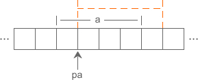

## 1分钟彻底理解C语言指针的概念

计算机中所有的数据都必须放在内存中，不同类型的数据占用的字节数不一样，例如 int 占用4个字节，char 占用1个字节。为了正确地访问这些数据，必须为每个字节都编上号码，就像门牌号、身份证号一样，每个字节的编号是唯一的，根据编号可以准确地找到某个字节。

下图是 4G 内存中每个字节的编号（以十六进制表示）：


我们将内存中字节的编号称为 **地址（Address）或指针（Pointer）**。地址从 0 开始依次增加，对于 32 位环境，程序能够使用的内存为 4GB，最小的地址为 0，最大的地址为 0XFFFFFFFF。

下面的代码演示了如何输出一个地址：

```C
#include <stdio.h>
int main(){
    int a = 100;
    char str[20] = "c.biancheng.net";
    printf("%#X, %#X\n", &a, str);
    return 0;
}
```

运行结果：
0X28FF3C, 0X28FF10

%#X表示以十六进制形式输出，并附带前缀0X。a 是一个变量，用来存放整数，需要在前面加&来获得它的地址；str 本身就表示字符串的首地址，不需要加&。

### 一切都是地址

C语言用变量来存储数据，用函数来定义一段可以重复使用的代码，它们最终都要放到内存中才能供 CPU 使用。

数据和代码都以二进制的形式存储在内存中，计算机无法从格式上区分某块内存到底存储的是数据还是代码。当程序被加载到内存后，操作系统会给不同的内存块指定不同的权限，拥有读取和执行权限的内存块就是代码，而拥有读取和写入权限（也可能只有读取权限）的内存块就是数据。

CPU 只能通过地址来取得内存中的代码和数据，程序在执行过程中会告知 CPU 要执行的代码以及要读写的数据的地址。如果程序不小心出错，或者开发者有意为之，在 CPU 要写入数据时给它一个代码区域的地址，就会发生内存访问错误。这种内存访问错误会被硬件和操作系统拦截，强制程序崩溃，程序员没有挽救的机会。

**CPU 访问内存时需要的是地址，而不是变量名和函数名！变量名和函数名只是地址的一种助记符，当源文件被编译和链接成可执行程序后，它们都会被替换成地址。编译和链接过程的一项重要任务就是找到这些名称所对应的地址。**

假设变量 a、b、c 在内存中的地址分别是 0X1000、0X2000、0X3000，那么加法运算c = a + b;将会被转换成类似下面的形式：
```C
0X3000 = (0X1000) + (0X2000);
```

( )表示取值操作，整个表达式的意思是，取出地址 0X1000 和 0X2000 上的值，将它们相加，把相加的结果赋值给地址为 0X3000 的内存

变量名和函数名为我们提供了方便，让我们在编写代码的过程中可以使用易于阅读和理解的英文字符串，不用直接面对二进制地址，那场景简直让人崩溃。

需要注意的是，虽然变量名、函数名、字符串名和数组名在本质上是一样的，它们都是地址的助记符，但在编写代码的过程中，我们认为变量名表示的是数据本身，而函数名、字符串名和数组名表示的是代码块或数据块的首地址。

关于程序内存、编译链接、可执行文件的结构以及如何找到名称对应的地址，我们将在《C语言内存》和《C语言模块化开发》专题中深入探讨。

## 大话C语言指针变量

数据在内存中的地址也称为指针，如果一个变量存储了一份数据的指针，我们就称它为指针变量。

在C语言中，允许用一个变量来存放指针，这种变量称为指针变量。指针变量的值就是某份数据的地址，这样的一份数据可以是数组、字符串、函数，也可以是另外的一个普通变量或指针变量。

现在假设有一个 char 类型的变量 c，它存储了字符 'K'（ASCII码为十进制数 75），并占用了地址为 0X11A 的内存（地址通常用十六进制表示）。另外有一个指针变量 p，它的值为 0X11A，正好等于变量 c 的地址，这种情况我们就称 p 指向了 c，或者说 p 是指向变量 c 的指针。


### 定义指针变量

定义指针变量与定义普通变量非常类似，不过要在变量名前面加星号*，格式为：

```C
datatype *name;
```

或者

```C
datatype *name = value;
```

* 表示这是一个指针变量，datatype表示该指针变量所指向的数据的类型 。例如：

```C
int *p1;
```

p1 是一个指向 int 类型数据的指针变量，至于 p1 究竟指向哪一份数据，应该由赋予它的值决定。再如：

```C
int a = 100;
int *p_a = &a;
```

在定义指针变量 p_a 的同时对它进行初始化，并将变量 a 的地址赋予它，此时 p_a 就指向了 a。值得注意的是，p_a 需要的一个地址，a 前面必须要加取地址符&，否则是不对的。

和普通变量一样，指针变量也可以被多次写入，只要你想，随时都能够改变指针变量的值，请看下面的代码：

```C
//定义普通变量
float a = 99.5, b = 10.6;
char c = '@', d = '#';
//定义指针变量
float *p1 = &a;
char *p2 = &c;
//修改指针变量的值
p1 = &b;
p2 = &d;
```

* 是一个特殊符号，表明一个变量是指针变量，定义 p1、p2 时必须带*。而给 p1、p2 赋值时，因为已经知道了它是一个指针变量，就没必要多此一举再带上*，后边可以像使用普通变量一样来使用指针变量。**也就是说，定义指针变量时必须带*，给指针变量赋值时不能带*。**

假设变量 a、b、c、d 的地址分别为 0X1000、0X1004、0X2000、0X2004，下面的示意图很好地反映了 p1、p2 指向的变化：


需要强调的是，p1、p2 的类型分别是float*和char*，而不是float和char，它们是完全不同的数据类型，读者要引起注意。

指针变量也可以连续定义，例如：

```C
int *a, *b, *c;  //a、b、c 的类型都是 int*
```

注意每个变量前面都要带*。如果写成下面的形式，那么只有 a 是指针变量，b、c 都是类型为 int 的普通变量：

```C
int *a, b, c;
```

### 通过指针变量取得数据

指针变量存储了数据的地址，通过指针变量能够获得该地址上的数据，格式为：
```C
*pointer;
```

这里的*称为指针运算符，用来取得某个地址上的数据，请看下面的例子：

```C
#include <stdio.h>
int main(){
    int a = 15;
    int *p = &a;
    printf("%d, %d\n", a, *p);  //两种方式都可以输出a的值
    return 0;
}
```

运行结果：
15, 15

假设 a 的地址是 0X1000，p 指向 a 后，p 本身的值也会变为 0X1000，`*p` 表示获取地址 0X1000 上的数据，也即变量 a 的值。从运行结果看，`*p` 和 a 是等价的。

上节我们说过，CPU 读写数据必须要知道数据在内存中的地址，普通变量和指针变量都是地址的助记符，虽然通过 *p 和 a 获取到的数据一样，但它们的运行过程稍有不同：a 只需要一次运算就能够取得数据，而 *p 要经过两次运算，多了一层“间接”。

假设变量 a、p 的地址分别为 0X1000、0XF0A0，它们的指向关系如下图所示：


程序被编译和链接后，a、p 被替换成相应的地址。使用 *p 的话，要先通过地址 0XF0A0 取得变量 p 本身的值，这个值是变量 a 的地址，然后再通过这个值取得变量 a 的数据，前后共有两次运算；而使用 a 的话，可以通过地址 0X1000 直接取得它的数据，只需要一步运算。

## C语言指针变量的运算

指针变量保存的是地址，本质上是一个整数，可以进行部分运算，例如加法、减法、比较等，请看下面的代码：

```C
#include <stdio.h>
int main(){
    int    a = 10,   *pa = &a, *paa = &a;
    double b = 99.9, *pb = &b;
    char   c = '@',  *pc = &c;
    //最初的值
    printf("&a=%#X, &b=%#X, &c=%#X\n", &a, &b, &c);
    printf("pa=%#X, pb=%#X, pc=%#X\n", pa, pb, pc);
    //加法运算
    pa++; pb++; pc++;
    printf("pa=%#X, pb=%#X, pc=%#X\n", pa, pb, pc);
    //减法运算
    pa -= 2; pb -= 2; pc -= 2;
    printf("pa=%#X, pb=%#X, pc=%#X\n", pa, pb, pc);
    //比较运算
    if(pa == paa){
        printf("%d\n", *paa);
    }else{
        printf("%d\n", *pa);
    }
    return 0;
}
```

运行结果：

```
&a=0X28FF44, &b=0X28FF30, &c=0X28FF2B
pa=0X28FF44, pb=0X28FF30, pc=0X28FF2B
pa=0X28FF48, pb=0X28FF38, pc=0X28FF2C
pa=0X28FF40, pb=0X28FF28, pc=0X28FF2A
2686784
```

从运算结果可以看出：pa、pb、pc 每次加 1，它们的地址分别增加 4、8、1，正好是 int、double、char 类型的长度；减 2 时，地址分别减少 8、16、2，正好是 int、double、char 类型长度的 2 倍。

这很奇怪，指针变量加减运算的结果跟数据类型的长度有关，而不是简单地加 1 或减 1，这是为什么呢？

以 a 和 pa 为例，a 的类型为 int，占用 4 个字节，pa 是指向 a 的指针，如下图所示：


刚开始的时候，pa 指向 a 的开头，通过 *pa 读取数据时，从 pa 指向的位置向后移动 4 个字节，把这 4 个字节的内容作为要获取的数据，这 4 个字节也正好是变量 a 占用的内存。

如果pa++;使得地址加 1 的话，就会变成如下图所示的指向关系：



这个时候 pa 指向整数 a 的中间，*pa 使用的是红色虚线画出的 4 个字节，其中前 3 个是变量 a 的，后面 1 个是其它数据的，把它们“搅和”在一起显然没有实际的意义，取得的数据也会非常怪异。

如果pa++;使得地址加 4 的话，正好能够完全跳过整数 a，指向它后面的内存，如下图所示：


我们知道，数组中的所有元素在内存中是连续排列的，如果一个指针指向了数组中的某个元素，那么加 1 就表示指向下一个元素，减 1 就表示指向上一个元素，这样指针的加减运算就具有了现实的意义，我们将在《C语言和数组》一节中深入探讨。

不过C语言并没有规定变量的存储方式，如果连续定义多个变量，它们有可能是挨着的，也有可能是分散的，这取决于变量的类型、编译器的实现以及具体的编译模式，所以对于指向普通变量的指针，我们往往不进行加减运算，虽然编译器并不会报错，但这样做没有意义，因为不知道它后面指向的是什么数据。

下面的例子是一个反面教材，警告读者不要尝试通过指针获取下一个变量的地址：

```C
#include <stdio.h>
int main(){
    int a = 1, b = 2, c = 3;
    int *p = &c;
    int i;
    for(i=0; i<8; i++){
        printf("%d, ", *(p+i) );
    }
    return 0;
}
```

在 VS2010 Debug 模式下的运行结果为：
```
3, -858993460, -858993460, 2, -858993460, -858993460, 1, -858993460,
```

可以发现，变量 a、b、c 并不挨着，它们中间还参杂了别的辅助数据。

**指针变量除了可以参与加减运算，还可以参与比较运算。当对指针变量进行比较运算时，比较的是指针变量本身的值，也就是数据的地址。如果地址相等，那么两个指针就指向同一份数据，否则就指向不同的数据。**

上面的代码（第一个例子）在比较 pa 和 paa 的值时，pa 已经指向了 a 的上一份数据，所以它们不相等。而 a 的上一份数据又不知道是什么，所以会导致 printf() 输出一个没有意义的数，这正好印证了上面的观点，不要对指向普通变量的指针进行加减运算。

另外需要说明的是，不能对指针变量进行乘法、除法、取余等其他运算，除了会发生语法错误，也没有实际的含义。

## C语言数组指针（指向数组的指针）

数组（Array）是一系列具有相同类型的数据的集合，每一份数据叫做一个数组元素（Element）。数组中的所有元素在内存中是连续排列的，整个数组占用的是一块内存。以int arr[] = { 99, 15, 100, 888, 252 };为例，该数组在内存中的分布如下图所示：


定义数组时，要给出数组名和数组长度，数组名可以认为是一个指针，它指向数组的第 0 个元素。**在C语言中，我们将第 0 个元素的地址称为数组的首地址。** 以上面的数组为例，下图是 arr 的指向：


> 数组名的本意是表示整个数组，也就是表示多份数据的集合，但在使用过程中经常会转换为指向数组第 0 个元素的指针，所以上面使用了“认为”一词，表示数组名和数组首地址并不总是等价。初学者可以暂时忽略这个细节，把数组名当做指向第 0 个元素的指针使用即可，我们将在VIP教程《数组和指针绝不等价，数组是另外一种类型》和《数组在什么时候会转换为指针》中再深入讨论这一细节。

下面的例子演示了如何以指针的方式遍历数组元素：

```C
#include <stdio.h>
int main(){
    int arr[] = { 99, 15, 100, 888, 252 };
    int len = sizeof(arr) / sizeof(int);  //求数组长度
    int i;
    for(i=0; i<len; i++){
        printf("%d  ", *(arr+i) );  //*(arr+i)等价于arr[i]
    }
    printf("\n");
    return 0;
}
```

运行结果：
99  15  100  888  252

第 5 行代码用来求数组的长度，sizeof(arr) 会获得整个数组所占用的字节数，sizeof(int) 会获得一个数组元素所占用的字节数，它们相除的结果就是数组包含的元素个数，也即数组长度。

第 8 行代码中我们使用了*(arr+i)这个表达式，arr 是数组名，指向数组的第 0 个元素，表示数组首地址， arr+i 指向数组的第 i 个元素，*(arr+i) 表示取第 i 个元素的数据，它等价于 arr[i]。

> arr 是int*类型的指针，每次加 1 时它自身的值会增加 sizeof(int)，加 i 时自身的值会增加 sizeof(int) * i，这在《指针变量的运算》中已经进行了详细讲解。

我们也可以定义一个指向数组的指针，例如：

```C
int arr[] = { 99, 15, 100, 888, 252 };
int *p = arr;
```

arr 本身就是一个指针，可以直接赋值给指针变量 p。arr 是数组第 0 个元素的地址，所以int *p = arr;也可以写作int *p = &arr[0];。也就是说，arr、p、&arr[0] 这三种写法都是等价的，它们都指向数组第 0 个元素，或者说指向数组的开头。

> 再强调一遍，“arr 本身就是一个指针”这种表述并不准确，严格来说应该是“arr 被转换成了一个指针”。这里请大家先忽略这个细节，我们将在VIP教程《数组和指针绝不等价，数组是另外一种类型》和《数组在什么时候会转换为指针》中深入讨论。

如果一个指针指向了数组，我们就称它为数组指针（Array Pointer）。

数组指针指向的是数组中的一个具体元素，而不是整个数组，所以数组指针的类型和数组元素的类型有关，上面的例子中，p 指向的数组元素是 int 类型，所以 p 的类型必须也是int *。

反过来想，p 并不知道它指向的是一个数组，p 只知道它指向的是一个整数，究竟如何使用 p 取决于程序员的编码。

更改上面的代码，使用数组指针来遍历数组元素：

```C
#include <stdio.h>
int main(){
    int arr[] = { 99, 15, 100, 888, 252 };
    int i, *p = arr, len = sizeof(arr) / sizeof(int);
    for(i=0; i<len; i++){
        printf("%d  ", *(p+i) );
    }
    printf("\n");
    return 0;
}
```

数组在内存中只是数组元素的简单排列，没有开始和结束标志，在求数组的长度时不能使用sizeof(p) / sizeof(int)，因为 p 只是一个指向 int 类型的指针，编译器并不知道它指向的到底是一个整数还是一系列整数（数组），所以 sizeof(p) 求得的是 p 这个指针变量本身所占用的字节数，而不是整个数组占用的字节数。

也就是说，根据数组指针不能逆推出整个数组元素的个数，以及数组从哪里开始、到哪里结束等信息。不像字符串，数组本身也没有特定的结束标志，如果不知道数组的长度，那么就无法遍历整个数组。

上节我们讲到，对指针变量进行加法和减法运算时，是根据数据类型的长度来计算的。如果一个指针变量 p 指向了数组的开头，那么 p+i 就指向数组的第 i 个元素；如果 p 指向了数组的第 n 个元素，那么 p+i 就是指向第 n+i 个元素；而不管 p 指向了数组的第几个元素，p+1 总是指向下一个元素，p-1 也总是指向上一个元素。

更改上面的代码，让 p 指向数组中的第二个元素：

```C
#include <stdio.h>
int main(){
    int arr[] = { 99, 15, 100, 888, 252 };
    int *p = &arr[2];  //也可以写作 int *p = arr + 2;
    printf("%d, %d, %d, %d, %d\n", *(p-2), *(p-1), *p, *(p+1), *(p+2) );
    return 0;
}
```

运行结果：
99, 15, 100, 888, 252

引入数组指针后，我们就有两种方案来访问数组元素了，一种是使用下标，另外一种是使用指针。

#### 1) 使用下标

也就是采用 arr[i] 的形式访问数组元素。如果 p 是指向数组 arr 的指针，那么也可以使用 p[i] 来访问数组元素，它等价于 arr[i]。

#### 2) 使用指针

也就是使用 *(p+i) 的形式访问数组元素。另外数组名本身也是指针，也可以使用 *(arr+i) 来访问数组元素，它等价于 *(p+i)。

不管是数组名还是数组指针，都可以使用上面的两种方式来访问数组元素。不同的是，数组名是常量，它的值不能改变，而数组指针是变量（除非特别指明它是常量），它的值可以任意改变。也就是说，数组名只能指向数组的开头，而数组指针可以先指向数组开头，再指向其他元素。

更改上面的代码，借助自增运算符来遍历数组元素：

```C
#include <stdio.h>
int main(){
    int arr[] = { 99, 15, 100, 888, 252 };
    int i, *p = arr, len = sizeof(arr) / sizeof(int);
    for(i=0; i<len; i++){
        printf("%d  ", *p++ );
    }
    printf("\n");
    return 0;
}
```

运行结果：
99  15  100  888  252

第 8 行代码中，*p++ 应该理解为 *(p++)，每次循环都会改变 p 的值（p++ 使得 p 自身的值增加），以使 p 指向下一个数组元素。该语句不能写为 *arr++，因为 arr 是常量，而 arr++ 会改变它的值，这显然是错误的。

### 关于数组指针的谜题

假设 p 是指向数组 arr 中第 n 个元素的指针，那么 *p++、*++p、(*p)++ 分别是什么意思呢？

*p++ 等价于 *(p++)，表示先取得第 n 个元素的值，再将 p 指向下一个元素，上面已经进行了详细讲解。

*++p 等价于 *(++p)，会先进行 ++p 运算，使得 p 的值增加，指向下一个元素，整体上相当于 *(p+1)，所以会获得第 n+1 个数组元素的值。

(*p)++ 就非常简单了，会先取得第 n 个元素的值，再对该元素的值加 1。假设 p 指向第 0  个元素，并且第 0 个元素的值为 99，执行完该语句后，第 0  个元素的值就会变为 100。

## C语言字符串指针（指向字符串的指针）

C语言中没有特定的字符串类型，我们通常是将字符串放在一个字符数组中，这在《C语言字符数组和字符串》中已经进行了详细讲解，这里不妨再来演示一下：

```C
#include <stdio.h>
#include <string.h>
int main(){
    char str[] = "http://c.biancheng.net";
    int len = strlen(str), i;
    //直接输出字符串
    printf("%s\n", str);
    //每次输出一个字符
    for(i=0; i<len; i++){
        printf("%c", str[i]);
    }
    printf("\n");
    return 0;
}
```

运行结果：
http://c.biancheng.net
http://c.biancheng.net

字符数组归根结底还是一个数组，上节讲到的关于指针和数组的规则同样也适用于字符数组。更改上面的代码，使用指针的方式来输出字符串：

```C
#include <stdio.h>
#include <string.h>
int main(){
    char str[] = "http://c.biancheng.net";
    char *pstr = str;
    int len = strlen(str), i;
    //使用*(pstr+i)
    for(i=0; i<len; i++){
        printf("%c", *(pstr+i));
    }
    printf("\n");
    //使用pstr[i]
    for(i=0; i<len; i++){
        printf("%c", pstr[i]);
    }
    printf("\n");
    //使用*(str+i)
    for(i=0; i<len; i++){
        printf("%c", *(str+i));
    }
    printf("\n");
    return 0;
}
```

运行结果：
http://c.biancheng.net
http://c.biancheng.net
http://c.biancheng.net

除了字符数组，C语言还支持另外一种表示字符串的方法，就是直接使用一个指针指向字符串，例如：

```C
char *str = "http://c.biancheng.net";
```

或者：

```C
char *str;
str = "http://c.biancheng.net";
```

字符串中的所有字符在内存中是连续排列的，str 指向的是字符串的第 0 个字符；我们通常将第 0  个字符的地址称为字符串的首地址。字符串中每个字符的类型都是char，所以 str 的类型也必须是char *。

下面的例子演示了如何输出这种字符串：

```C
#include <stdio.h>
#include <string.h>
int main(){
    char *str = "http://c.biancheng.net";
    int len = strlen(str), i;

    //直接输出字符串
    printf("%s\n", str);
    //使用*(str+i)
    for(i=0; i<len; i++){
        printf("%c", *(str+i));
    }
    printf("\n");
    //使用str[i]
    for(i=0; i<len; i++) {
        printf("%c", str[i]);
    }
    printf("\n");
    return 0;
}
```

运行结果：
http://c.biancheng.net
http://c.biancheng.net
http://c.biancheng.net

这一切看起来和字符数组是多么地相似，它们都可以使用%s输出整个字符串，都可以使用*或[ ]获取单个字符，这两种表示字符串的方式是不是就没有区别了呢？

**有！它们最根本的区别是在内存中的存储区域不一样，字符数组存储在全局数据区或栈区，第二种形式的字符串存储在常量区。全局数据区和栈区的字符串（也包括其他数据）有读取和写入的权限，而常量区的字符串（也包括其他数据）只有读取权限，没有写入权限。**

>关于全局数据区、栈区、常量区以及其他的内存分区，我们将在《C语言和内存》专题中详细讲解，相信你必将有所顿悟，从根本上理解C语言。

内存权限的不同导致的一个明显结果就是，字符数组在定义后可以读取和修改每个字符，而对于第二种形式的字符串，一旦被定义后就只能读取不能修改，任何对它的赋值都是错误的。

我们将第二种形式的字符串称为字符串常量，意思很明显，常量只能读取不能写入。请看下面的演示：

```C
#include <stdio.h>
int main(){
    char *str = "Hello World!";
    str = "I love C!";  //正确
    str[3] = 'P';  //错误
    return 0;
}
```

这段代码能够正常编译和链接，但在运行时会出现段错误（Segment Fault）或者写入位置错误。

第4行代码是正确的，可以更改指针变量本身的指向；第5行代码是错误的，不能修改字符串中的字符。

### 到底使用字符数组还是字符串常量

在编程过程中如果只涉及到对字符串的读取，那么字符数组和字符串常量都能够满足要求；如果有写入（修改）操作，那么只能使用字符数组，不能使用字符串常量。

获取用户输入的字符串就是一个典型的写入操作，只能使用字符数组，不能使用字符串常量，请看下面的代码：

```C
#include <stdio.h>
int main(){
    char str[30];
    gets(str);
    printf("%s\n", str);
    return 0;
}
```

运行结果：
C C++ Java Python JavaScript
C C++ Java Python JavaScript

最后我们来总结一下，C语言有两种表示字符串的方法，一种是字符数组，另一种是字符串常量，它们在内存中的存储位置不同，使得字符数组可以读取和修改，而字符串常量只能读取不能修改。
