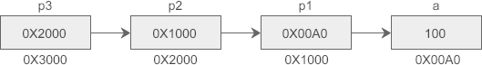

## C语言数组灵活多变的访问形式

C语言中的指针使得代码的编写非常灵活，如果指针能够和数组结合，那将会有更多的“花招”，请看下面的代码：

```C
#include <stdio.h>
int main(){
    char str[20] = "c.biancheng.net";

    char *s1 = str;
    char *s2 = str+2;

    char c1 = str[4];
    char c2 = *str;
    char c3 = *(str+4);
    char c4 = *str+2;
    char c5 = (str+1)[5];

    int num1 = *str+2;
    long num2 = (long)str;
    long num3 = (long)(str+2);
    printf("  s1 = %s\n", s1);
    printf("  s2 = %s\n", s2);
    printf("  c1 = %c\n", c1);
    printf("  c2 = %c\n", c2);
    printf("  c3 = %c\n", c3);
    printf("  c4 = %c\n", c4);
    printf("  c5 = %c\n", c5);

    printf("num1 = %d\n", num1);
    printf("num2 = %ld\n", num2);
    printf("num3 = %ld\n", num3);
    return 0;
}
```

怎么样，够晕吧，如果你嗤之以鼻，那么恭喜你，你的C语言基础很扎实。

1) str 既是数组名称，也是一个指向字符串的指针；指针可以参加运算，加 1 相当于数组下标加 1。

printf() 输出字符串时，要求给出一个起始地址，并从这个地址开始输出，直到遇见字符串结束标志\0。s1 为字符串 str 第 0 个字符的地址，s2 为第 2 个字符的地址，所以 printf() 的结果分别为 c.biancheng.net 和 biancheng.net。

2) 指针可以参加运算，str+4 表示第 4 个字符的地址，c3 = *(str+4) 表示第4个字符，即 'a'。

3) 其实，数组元素的访问形式可以看做 address[offset]，address 为起始地址，offset 为偏移量：c1 = str[4]表示以地址 str 为起点，向后偏移4个字符，为 'a'；c5 = (str+1)[5]表示以地址 str+1 为起点，向后偏移5个字符，等价于str[6]，为 'c'。

4) 字符与整数运算时，先转换为整数（字符对应的ASCII码）。num1 与 c4 右边的表达式相同，对于 num1，*str+2 == 'c'+2 == 99+2 == 101，即 num1 的值为 101，对于 c4，101 对应的字符为 ‘e’，所以 c4 的输出值为 'e'。

5) num2 和 num3 分别为字符串 str 的首地址和第 2 个元素的地址。

为了加深大家的理解，请继续阅读下面的代码：

```C
#include <stdio.h>
#include <stdlib.h>
int main(){
    char str[20] = {0};
    int i;
    for(i=0; i<10; i++){
        *(str+i) = 97+i;  // 97为字符a的ASCII码值
    }

    printf("%s\n", str);
    printf("%s\n", str+2);
    printf("%c\n", str[2]);
    printf("%c\n", (str+2)[2]);

    return 0;
}
```

运行结果：
```C
abcdefghij
cdefghij
c
e
```

## C语言指针变量作为函数参数

在C语言中，函数的参数不仅可以是整数、小数、字符等具体的数据，还可以是指向它们的指针。用指针变量作函数参数可以将函数外部的地址传递到函数内部，使得在函数内部可以操作函数外部的数据，并且这些数据不会随着函数的结束而被销毁。

像数组、字符串、动态分配的内存等都是一系列数据的集合，没有办法通过一个参数全部传入函数内部，只能传递它们的指针，在函数内部通过指针来影响这些数据集合。

有的时候，对于整数、小数、字符等基本类型数据的操作也必须要借助指针，一个典型的例子就是交换两个变量的值。

有些初学者可能会使用下面的方法来交换两个变量的值：

```C

#include <stdio.h>
void swap(int a, int b){
    int temp;  //临时变量
    temp = a;
    a = b;
    b = temp;
}
int main(){
    int a = 66, b = 99;
    swap(a, b);
    printf("a = %d, b = %d\n", a, b);
    return 0;
}
```

运行结果：
a = 66, b = 99

从结果可以看出，a、b 的值并没有发生改变，交换失败。这是因为 swap() 函数内部的 a、b 和 main() 函数内部的 a、b 是不同的变量，占用不同的内存，它们除了名字一样，没有其他任何关系，swap() 交换的是它内部 a、b 的值，不会影响它外部（main() 内部） a、b 的值。

改用指针变量作参数后就很容易解决上面的问题：

```C
#include <stdio.h>
void swap(int *p1, int *p2){
    int temp;  //临时变量
    temp = *p1;
    *p1 = *p2;
    *p2 = temp;
}
int main(){
    int a = 66, b = 99;
    swap(&a, &b);
    printf("a = %d, b = %d\n", a, b);
    return 0;
}
```

运行结果：
a = 99, b = 66

调用 swap() 函数时，将变量 a、b 的地址分别赋值给 p1、p2，这样 *p1、*p2 代表的就是变量 a、b 本身，交换 *p1、*p2 的值也就是交换 a、b 的值。函数运行结束后虽然会将 p1、p2 销毁，但它对外部 a、b 造成的影响是“持久化”的，不会随着函数的结束而“恢复原样”。

需要注意的是临时变量 temp，它的作用特别重要，因为执行*p1 = *p2;语句后 a 的值会被 b 的值覆盖，如果不先将 a 的值保存起来以后就找不到了。

### 用数组作函数参数

数组是一系列数据的集合，无法通过参数将它们一次性传递到函数内部，如果希望在函数内部操作数组，必须传递数组指针。下面的例子定义了一个函数 max()，用来查找数组中值最大的元素：

```C
#include <stdio.h>
int max(int *intArr, int len){
    int i, maxValue = intArr[0];  //假设第0个元素是最大值
    for(i=1; i<len; i++){
        if(maxValue < intArr[i]){
            maxValue = intArr[i];
        }
    }

    return maxValue;
}
int main(){
    int nums[6], i;
    int len = sizeof(nums)/sizeof(int);
    //读取用户输入的数据并赋值给数组元素
    for(i=0; i<len; i++){
        scanf("%d", nums+i);
    }
    printf("Max value is %d!\n", max(nums, len));
    return 0;
}
```

运行结果：
12 55 30 8 93 27↙
Max value is 93!

参数 intArr 仅仅是一个数组指针，在函数内部无法通过这个指针获得数组长度，必须将数组长度作为函数参数传递到函数内部。数组 nums 的每个元素都是整数，scanf() 在读取用户输入的整数时，要求给出存储它的内存的地址，nums+i就是第 i 个数组元素的地址。

用数组做函数参数时，参数也能够以“真正”的数组形式给出。例如对于上面的 max() 函数，它的参数可以写成下面的形式：

```C
int max(int intArr[6], int len){
    int i, maxValue = intArr[0];  //假设第0个元素是最大值
    for(i=1; i<len; i++){
        if(maxValue < intArr[i]){
            maxValue = intArr[i];
        }
    }
    return maxValue;
}
```

int intArr[6]好像定义了一个拥有 6 个元素的数组，调用 max() 时可以将数组的所有元素“一股脑”传递进来。

读者也可以省略数组长度，把形参简写为下面的形式：

```C
int max(int intArr[], int len){
    int i, maxValue = intArr[0];  //假设第0个元素是最大值
    for(i=1; i<len; i++){
        if(maxValue < intArr[i]){
            maxValue = intArr[i];
        }
    }
    return maxValue;
}
```

int intArr[]虽然定义了一个数组，但没有指定数组长度，好像可以接受任意长度的数组。

实际上这两种形式的数组定义都是假象，不管是int intArr[6]还是int intArr[]都不会创建一个数组出来，编译器也不会为它们分配内存，实际的数组是不存在的，它们最终还是会转换为int *intArr这样的指针。这就意味着，两种形式都不能将数组的所有元素“一股脑”传递进来，大家还得规规矩矩使用数组指针。

int intArr[6]这种形式只能说明函数期望用户传递的数组有 6 个元素，并不意味着数组只能有 6 个元素，真正传递的数组可以有少于或多于 6 个的元素。

需要强调的是，不管使用哪种方式传递数组，都不能在函数内部求得数组长度，因为 intArr 仅仅是一个指针，而不是真正的数组，所以必须要额外增加一个参数来传递数组长度。

C语言为什么不允许直接传递数组的所有元素，而必须传递数组指针呢？

**参数的传递本质上是一次赋值的过程，赋值就是对内存进行拷贝。所谓内存拷贝，是指将一块内存上的数据复制到另一块内存上。**

对于像 int、float、char 等基本类型的数据，它们占用的内存往往只有几个字节，对它们进行内存拷贝非常快速。而数组是一系列数据的集合，数据的数量没有限制，可能很少，也可能成千上万，对它们进行内存拷贝有可能是一个漫长的过程，会严重拖慢程序的效率，为了防止技艺不佳的程序员写出低效的代码，C语言没有从语法上支持数据集合的直接赋值。

除了C语言，C++、Java、Python 等其它语言也禁止对大块内存进行拷贝，在底层都使用类似指针的方式来实现。

## 用C语言指针作为函数返回值

C语言允许函数的返回值是一个指针（地址），我们将这样的函数称为指针函数。下面的例子定义了一个函数 strlong()，用来返回两个字符串中较长的一个：

```C
#include <stdio.h>
#include <string.h>
char *strlong(char *str1, char *str2){
    if(strlen(str1) >= strlen(str2)){
        return str1;
    }else{
        return str2;
    }
}
int main(){
    char str1[30], str2[30], *str;
    gets(str1);
    gets(str2);
    str = strlong(str1, str2);
    printf("Longer string: %s\n", str);
    return 0;
}
```

运行结果：
C Language↙
c.biancheng.net↙
Longer string: c.biancheng.net

用指针作为函数返回值时需要注意的一点是，函数运行结束后会销毁在它内部定义的所有局部数据，包括局部变量、局部数组和形式参数，函数返回的指针请尽量不要指向这些数据，C语言没有任何机制来保证这些数据会一直有效，它们在后续使用过程中可能会引发运行时错误。请看下面的例子：

```C
#include <stdio.h>
int *func(){
    int n = 100;
    return &n;
}
int main(){
    int *p = func(), n;
    n = *p;
    printf("value = %d\n", n);
    return 0;
}
```

运行结果：
value = 100

n 是 func() 内部的局部变量，func() 返回了指向 n 的指针，根据上面的观点，func() 运行结束后 n 将被销毁，使用 *p 应该获取不到 n 的值。但是从运行结果来看，我们的推理好像是错误的，func() 运行结束后 *p 依然可以获取局部变量 n 的值，这个上面的观点不是相悖吗？

为了进一步看清问题的本质，不妨将上面的代码稍作修改，在第9~10行之间增加一个函数调用，看看会有什么效果：

```C
#include <stdio.h>
int *func(){
    int n = 100;
    return &n;
}

int main(){
    int *p = func(), n;
    printf("c.biancheng.net\n");
    n = *p;
    printf("value = %d\n", n);
    return 0;
}
```

n 是 func() 内部的局部变量，func() 返回了指向 n 的指针，根据上面的观点，func() 运行结束后 n 将被销毁，使用 `*p` 应该获取不到 n 的值。但是从运行结果来看，我们的推理好像是错误的，func() 运行结束后 `*p` 依然可以获取局部变量 n 的值，这个上面的观点不是相悖吗？

为了进一步看清问题的本质，不妨将上面的代码稍作修改，在第9~10行之间增加一个函数调用，看看会有什么效果：

```C
#include <stdio.h>
int *func(){
    int n = 100;
    return &n;
}
int main(){
    int *p = func(), n;
    printf("c.biancheng.net\n");
    n = *p;
    printf("value = %d\n", n);
    return 0;
}
```

可以看到，现在 p 指向的数据已经不是原来 n 的值了，它变成了一个毫无意义的甚至有些怪异的值。与前面的代码相比，该段代码仅仅是在 `*p` 之前增加了一个函数调用，这一细节的不同却导致运行结果有天壤之别，究竟是为什么呢？

**前面我们说函数运行结束后会销毁所有的局部数据，这个观点并没错，大部分C语言教材也都强调了这一点。但是，这里所谓的销毁并不是将局部数据所占用的内存全部抹掉，而是程序放弃对它的使用权限，弃之不理，后面的代码可以随意使用这块内存。对于上面的两个例子，func() 运行结束后 n 的内存依然保持原样，值还是 100，如果使用及时也能够得到正确的数据，如果有其它函数被调用就会覆盖这块内存，得到的数据就失去了意义。**

关于函数调用的原理以及函数如何占用内存的更多细节，我们将在《C语言和内存》专题中深入探讨，相信你必将有所顿悟，解开心中的谜团。

第一个例子在调用其他函数之前使用 `*p` 抢先获得了 n 的值并将它保存起来，第二个例子显然没有抓住机会，有其他函数被调用后才使用 `*p` 获取数据，这个时候已经晚了，内存已经被后来的函数覆盖了，而覆盖它的究竟是一份什么样的数据我们无从推断（一般是一个没有意义甚至有些怪异的值）。

-------

## C语言二级指针（指向指针的指针）

指针可以指向一份普通类型的数据，例如 int、double、char 等，也可以指向一份指针类型的数据，例如 `int *`、`double *`、`char *` 等。

如果一个指针指向的是另外一个指针，我们就称它为二级指针，或者指向指针的指针。

假设有一个 int 类型的变量 a，p1是指向 a 的指针变量，p2 又是指向 p1 的指针变量，它们的关系如下图所示：


将这种关系转换为C语言代码：

```C
int a =100;
int *p1 = &a;
int **p2 = &p1;
```

指针变量也是一种变量，也会占用存储空间，也可以使用&获取它的地址。C语言不限制指针的级数，每增加一级指针，在定义指针变量时就得增加一个星号*。p1 是一级指针，指向普通类型的数据，定义时有一个*；p2 是二级指针，指向一级指针 p1，定义时有两个*。

如果我们希望再定义一个三级指针 p3，让它指向 p2，那么可以这样写：

```C
int ***p3 = &p2;
```

四级指针也是类似的道理：

```C
int ****p4 = &p3;
```

实际开发中会经常使用一级指针和二级指针，几乎用不到高级指针。

想要获取指针指向的数据时，一级指针加一个*，二级指针加两个*，三级指针加三个*，以此类推，请看代码：

```C
#include <stdio.h>
int main(){
    int a =100;
    int *p1 = &a;
    int **p2 = &p1;
    int ***p3 = &p2;
    printf("%d, %d, %d, %d\n", a, *p1, **p2, ***p3);
    printf("&p2 = %#X, p3 = %#X\n", &p2, p3);
    printf("&p1 = %#X, p2 = %#X, *p3 = %#X\n", &p1, p2, *p3);
    printf(" &a = %#X, p1 = %#X, *p2 = %#X, **p3 = %#X\n", &a, p1, *p2, **p3);
    return 0;
}
```
运行结果：

100, 100, 100, 100
&p2 = 0X28FF3C, p3 = 0X28FF3C
&p1 = 0X28FF40, p2 = 0X28FF40, *p3 = 0X28FF40
 &a = 0X28FF44, p1 = 0X28FF44, *p2 = 0X28FF44, **p3 = 0X28FF44

以三级指针 p3 为例来分析上面的代码。`***p3`等价于`*(*(*p3))`。`*p3` 得到的是 `p2` 的值，也即 `p1` 的地址；`*(*p3)` 得到的是 `p1` 的值，也即 `a` 的地址；经过三次“取值”操作后，`*(*(*p3))` 得到的才是 `a` 的值。

假设 a、p1、p2、p3 的地址分别是 0X00A0、0X1000、0X2000、0X3000，它们之间的关系可以用下图来描述：



方框里面是变量本身的值，方框下面是变量的地址。

------

## C语言空指针NULL以及void指针

### 空指针 NULL

一个指针变量可以指向计算机中的任何一块内存，不管该内存有没有被分配，也不管该内存有没有使用权限，只要把地址给它，它就可以指向，C语言没有一种机制来保证指向的内存的正确性，程序员必须自己提高警惕。

很多初学者会在无意间对没有初始化的指针进行操作，这是非常危险的，请看下面的例子：

```C
#include <stdio.h>
int main(){
    char *str;
    gets(str);
    printf("%s\n", str);
    return 0;
}
```

这段程序没有语法错误，能够通过编译和链接，但当用户输入完字符串并按下回车键时就会发生错误，在 Linux 下表现为段错误（Segment Fault），在 Windows 下程序直接崩溃。如果你足够幸运，或者输入的字符串少，也可能不报错，这都是未知的。

前面（《C语言局部变量和全局变量》一节）我们讲过，未初始化的局部变量的值是不确定的，C语言并没有对此作出规定，不同的编译器有不同的实现，我曾警告大家不要直接使用未初始化的局部变量。上面的代码中，str 就是一个未初始化的局部变量，它的值是不确定的，究竟指向哪块内存也是未知的，大多数情况下这块内存没有被分配或者没有读写权限，使用 gets() 函数向它里面写入数据显然是错误的。

我强烈建议对没有初始化的指针赋值为 NULL，例如：

```C
char *str = NULL;
```

NULL 是“零值、等于零”的意思，在C语言中表示空指针。从表面上理解，空指针是不指向任何数据的指针，是无效指针，程序使用它不会产生效果。

>注意区分大小写，null 没有任何特殊含义，只是一个普通的标识符。

很多库函数都对传入的指针做了判断，如果是空指针就不做任何操作，或者给出提示信息。更改上面的代码，给 str 赋值 NULL，看看会有什么效果：

```C
#include <stdio.h>
int main(){
    char *str = NULL;
    gets(str);
    printf("%s\n", str);
    return 0;
}
```

运行程序后发现，还未等用户输入任何字符，printf() 就直接输出了(null)。我们有理由据此推断，gets() 和 printf() 都对空指针做了特殊处理：

- gets() 不会让用户输入字符串，也不会向指针指向的内存中写入数据；
- printf() 不会读取指针指向的内容，只是简单地给出提示，让程序员意识到使用了一个空指针。

我们在自己定义的函数中也可以进行类似的判断，例如：

```C
void func(char *p){
    if(p == NULL){
        printf("(null)\n");
    }else{
        printf("%s\n", p);
    }
}
```

这样能够从很大程度上增加程序的健壮性，防止对空指针进行无意义的操作。

其实，NULL 是在stdio.h中定义的一个宏，它的具体内容为：

```C
#define NULL ((void *)0)
```

**`(void *)0`表示把数值 0 强制转换为`void *`类型，最外层的( )把宏定义的内容括起来，防止发生歧义。从整体上来看，NULL 指向了地址为 0 的内存，而不是前面说的不指向任何数据。**

**在进程的虚拟地址空间中，最低地址处有一段内存区域被称为保留区，这个区域不存储有效数据，也不能被用户程序访问，将 NULL 指向这块区域很容易检测到违规指针。**

**关于虚拟地址空间的概念以及程序的内存分布，我们将在《C语言和内存》专题中深入讲解，现在读者只需要记住，在大多数操作系统中，极小的地址通常不保存数据，也不允许程序访问，NULL 可以指向这段地址区间中的任何一个地址。**

注意，C语言没有规定 NULL 的指向，只是大部分标准库约定成俗地将 NULL 指向 0，所以不要将 NULL 和 0 等同起来，例如下面的写法是不专业的：

```C
int *p = 0;
```

而应该坚持写为：

```C
int *p = NULL;
```

**注意 NULL 和 NUL 的区别：NULL 表示空指针，是一个宏定义，可以在代码中直接使用。而 NUL 表示字符串的结束标志 '\0'，它是ASCII码表中的第 0 个字符。NUL 没有在C语言中定义，仅仅是对 '\0' 的称呼，不能在代码中直接使用。**

### void 指针

对于空指针 NULL 的宏定义内容，上面只是对`((void *)0)`作了粗略的介绍，这里重点说一下`void *`的含义。void 用在函数定义中可以表示函数没有返回值或者没有形式参数，用在这里表示指针指向的数据的类型是未知的。

也就是说，`void *`表示一个有效指针，它确实指向实实在在的数据，只是数据的类型尚未确定，在后续使用过程中一般要进行强制类型转换。

C语言动态内存分配函数 malloc() 的返回值就是`void *`类型，在使用时要进行强制类型转换，请看下面的例子：

```C
#include <stdio.h>
int main(){
    //分配可以保存30个字符的内存，并把返回的指针转换为 char *
    char *str = (char *)malloc(sizeof(char) * 30);
    gets(str);
    printf("%s\n", str);
    return 0;
}
```

运行结果：
c.biancheng.net↙
c.biancheng.net

**关于动态内存分配的概念以及 malloc() 的具体用法，我们将在《C语言和内存》专题中详细说明，这里重点是让大家理解`void *`，它不是空指针的意思，而是实实在在的指针，只是指针指向的内存中不知道保存的是什么类型的数据。**
